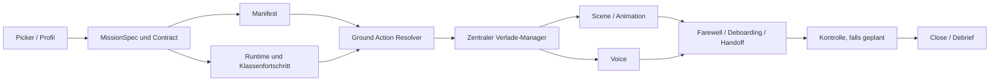

# Mission Flow Reference

Stand: 10.08.2026

Diese Datei ist die kurze operative Referenz fuer den aktuellen Missionsablauf.
Sie beantwortet zuerst:

- Welche Ablaufklasse verwendet eine Mission?
- Welche Aktion ist am Start, Ziel und Abschluss erlaubt?
- Welche Ladung, Unterschrift und Bestaetigung blockiert den naechsten Schritt?
- Wann duerfen Voice und Animation starten?
- Welche Datei besitzt die jeweilige Entscheidung?

Die ausfuehrlichen Regeln bleiben in:

- `docs/Mission Semantics Rules V4.md` fuer fachliche Bedeutung und Drift-Guardrails
- `docs/Mission Building Instructions.md` fuer Aufbau und Erweiterung
- `docs/Mission Test Strategy.md` fuer Testtiefe und Nachweise

Bei Widerspruechen gilt: Semantik bestimmt das fachliche Rezept; Core-Code und
Selftests muessen diesen Vertrag ausfuehren. Diese Referenz muss bei jeder
Ablaufaenderung mit aktualisiert werden.

## 1. Architektur in einem Bild



Verantwortlichkeiten:

| Schicht | Aufgabe | Darf nicht |
| --- | --- | --- |
| Profil / MissionSpec | Ablaufklasse und Missionsparameter festlegen | UI-Sonderpfade starten |
| Contract / MissionTruth | Auftrag, Ziel und Rollen stabil halten | Runtime-Zustand verstecken |
| Manifest | PAX, Fracht, Bordbestand und Lieferort beschreiben | Missionsphasen frei erfinden |
| Runtime / Fortschritt | erlaubten naechsten Zustand bestimmen | Voice als State Machine benutzen |
| Ground Action Resolver | `load`, `pickup`, `unload`, `end` oder `none` liefern | Dialoge selbst abschliessen |
| Verlade-Manager | Items, Signatur und Bestaetigung als Gates ausfuehren | Erfolg ohne Core-Gates freigeben |
| Scene / Voice | sichtbaren und erzaehlerischen Ablauf darstellen | fachlichen Missionserfolg setzen |

## 2. Universeller Start

Jede echte Mission verwendet dieselbe Startkette:

1. `planned`
2. Mission beginnen fordert `prepare` an.
3. Startszene wird am Flugzeug erzeugt.
4. Der zentrale Verlade-Manager zeigt Missionsladung und Bordbestand.
5. PAX steigt ueber den Boarding-Ablauf ein; Fracht wird in der Liste geladen.
6. Alle Pflichtpositionen des Start-Legs sind geladen.
7. Pilot unterschreibt die Frachtgutliste mit Scope `departure`.
8. Pilot bestaetigt die Verladung.
9. Boarding-Animation und Boarding-Voice sind abgeschlossen.
10. `boarded -> active`; erst jetzt ist der Flug freigegeben.

Startbanner und Boardbuchbanner sind Bedienhilfen. Sie ersetzen kein Runtime-
oder Manifest-Gate.

## 3. Der zentrale Verlade-Manager

Der Verlade-Manager ist die einzige zentrale Bedienoberflaeche fuer
Missionsladung. Alte separate Ankunfts-, Entlade- oder Pickup-Dialoge duerfen
keine zweite Abschlusslogik mehr bilden.

### 3.1 Gate-Matrix

| Modus | Sichtbare Positionen | Pflicht-Gate | Signatur-Scope | Separate Bestaetigung bewirkt |
| --- | --- | --- | --- | --- |
| `load` | Startladung, Start-PAX, Bordbestand | alle Start-Pflichtpositionen geladen | `departure` | Startverladung abgeschlossen |
| `pickup` | Ziel-PAX und/oder Ziel-Fracht | alle Ziel-Pflichtpositionen geladen | `pickup` | Pickup abgeschlossen, `return_leg` freigegeben |
| `unload` | geladene Zielladung, PAX, Bordbestand | alle hier abzuliefernden Pflicht-Cargo-Items entladen | `arrival` | Farewell/Deboarding oder Missionsende freigegeben |
| `equipment` | Bordbuch, Verbandzeug, Feuerloescher, Radkeile | kein Missionsfortschritt | keine | Fenster schliessen |

Fuer `load`, `pickup` und `unload` gilt immer:

1. Items bearbeiten.
2. Unterschreiben.
3. Signaturanimation abwarten.
4. Mit einem zweiten Klick bestaetigen.

Eine Item-Aenderung nach der Unterschrift loescht die Signatur wieder. Eine
Start-, Pickup- oder Ankunftsunterschrift kann wegen der getrennten Scopes
niemals eine andere Station freigeben.

### 3.2 Pickup im Detail

Passenger-Pickup:

1. Am Zielpunkt stillstehen.
2. Verlade-Manager im Modus `pickup` oeffnen.
3. PAX-Zeile anklicken; Boarding-Animation abwarten.
4. Begleitfracht anklicken und laden.
5. Erst wenn beide Pflichtpositionen an Bord sind, wird die Pickup-Unterschrift
   freigegeben.
6. Mit Scope `pickup` unterschreiben.
7. Danach `Pickup bestaetigen und Rueckflug freigeben` anklicken.
8. Fortschritt setzt `pickupCompleted`, `pickupConfirmed` und `return_leg`.

Die wartende Person bleibt fachlich Teil der APT-/Strip-Arrival-Szene, wird in
der an den Tracker gesendeten Szene aber als `person_boarder_1` markiert. Nur
so darf der zentrale Pickup-Klick die sichtbare Person in die bestehende
`mission_scene_boarding`-Animation uebernehmen. Normale Empfangskontakte
bleiben `arrival_person_*` und koennen nicht versehentlich einsteigen.

Cargo-Pickup verwendet denselben Ablauf ohne PAX-Boarding. Die Fracht bleibt
bis zum Home-Unload Pflichtladung.

Auch ein am Start wirklich leerer Pickup-Hinflug durchlaeuft den Modus `load`.
Es gibt dabei keine Startladung anzuklicken, aber die leere Abflugliste wird
wie bei jeder anderen Mission unterschrieben und mit dem zweiten Klick
bestaetigt. Pickup-Missionen besitzen keinen separaten Start-Shortcut.

## 4. Ablaufklassen

Profile veraendern Story, Rolle, Ziel, Manifest und Szene. Eine neue
Ablaufklasse ist nur noetig, wenn sich die fachlichen Gates aendern.

| Ablaufklasse | Referenzprofile | Zielaktion | Rueckflug | Abschluss |
| --- | --- | --- | --- | --- |
| APT Arrival | Charter, Privat, Cargo, Medical, Tiertransport | Landung am Zielflugplatz | nein | Ziel-Unload/Signatur, Farewell/Deboarding, Close |
| POI On-Task | Inspection, Foto, Survey, Sightseeing, Fire Watch, SAR | Task in Radius/Hoehe/Dwell oder Pattern | optional | definierter Abschlussort, Unload/Signatur, Farewell, Close |
| Bush Strip Target | `bush_supply_strip`, `bush_charter_strip`, `bush_scenic_hopper` | Landung und ggf. Unload/Dropoff am Strip | nein | Ziel-Unload/Signatur oder Landebestaetigung, Close |
| Pickup Return Passenger | `bush_pickup_strip`, `apt_charter_pickup` Follow-up | PAX plus Begleitfracht am Ziel laden | ja | Home-Unload/Signatur, Farewell/Deboarding, Close |
| Pickup Return Cargo | `bush_pickup_cargo` | Rueckholfracht am Ziel laden | ja | Home-Unload/Signatur, Close |
| POI Return Home | `bush_recon_return` und andere RTB-POI-Rezepte | Air-Task, keine Ziel-Landung als Erfolg | ja | Home-Unload/Signatur, Farewell, Close |

### 4.1 APT Arrival

Grundform: `A -> B`

```text
departure load/sign/confirm
-> boarding complete
-> active flight
-> touchdown/ground still
-> arrival banner
-> unload/sign/confirm
-> farewell and deboarding
-> optional inspection
-> close
```

Regeln:

- Das Verladefenster oeffnet nach der Landung nicht automatisch; der Pilot soll
  beim Rollen die Karte sehen.
- Der PAX-Klick im Verlade-Manager kann Deboarding vorbereiten. Der fachliche
  Abschluss bleibt an Pflicht-Cargo, Ankunftssignatur und Bestaetigung gebunden.
- Eine APT-Arrival-Szene konkretisiert den Handoff, erzeugt aber keinen zweiten
  Missionsabschluss.

### 4.2 POI On-Task

Grundform: `A -> B (Task)` oder `A -> B (Task) -> A`

```text
start
-> enroute
-> target radius / altitude / dwell / pattern
-> on_task complete
-> optional return_leg
-> ground at defined finish
-> unload/sign/confirm
-> farewell
-> close
```

Regeln:

- Landen am POI ersetzt die Task-Erfuellung nicht.
- Pflicht-Missionsfracht wird am tatsaechlichen Abschlussort entladen.
- Fire Watch, SAR, Survey und Training sind Unterrezepte, keine eigenen
  parallelen Abschlussmaschinen.

### 4.3 Bush Strip Target

Grundform: `A -> B`

- `bush_supply_strip`: Pflichtfracht am Zielstrip entladen.
- `bush_charter_strip`: PAX am Ziel verabschieden.
- `bush_scenic_hopper`: Landung am Ziel ist der Missionskern; kein kuenstlicher
  Return-Leg.

Alle drei verwenden die zentralen Ankunfts- und Verlade-Gates. Bush-Atmosphaere
allein rechtfertigt keinen abweichenden Close-Pfad.

### 4.4 Pickup Return

Grundform: `A -> B (Landung und Pickup) -> A`

```text
empty outbound
-> pickup_ready
-> pickup manager
-> target items loaded
-> pickup signature
-> pickup confirmation
-> return_leg
-> home_unloading
-> arrival signature and confirmation
-> farewell/deboarding if PAX
-> optional inspection
-> close
```

Verboten:

- Rueckflug vor Pickup-Signatur und Bestaetigung
- Abschluss am Pickup-Punkt
- Home-Abschluss mit noch geladener Pflichtfracht
- Wiederverwendung der `departure`-Signatur als Pickup-Signatur
- separates altes PAX-Popup als zweiter Pickup-Controller

### 4.5 Bush Recon / POI Return Home

Grundform: `A -> B (Task ohne Landung) -> A`

- Das Ziel ist Arbeitsgebiet, kein Pickup-Punkt.
- Task-Erfuellung folgt der POI-Logik.
- Erst danach wird `return_leg` aktiv.
- Pflichtfracht wird zuhause entladen und die Ankunft unterschrieben.

## 5. Farewell, Deboarding und Kontrolle

Reihenfolge am Missionsende:

1. Pflicht-Cargo ist entladen.
2. Ankunftsliste ist unterschrieben und bestaetigt.
3. Farewell-Audio wird gestartet oder aus dem Preload abgespielt.
4. Deboarding darf parallel vorbereitet werden, wartet fachlich aber auf die
   Farewell-Freigabe.
5. Eine geplante Behoerdenkontrolle wartet mit ihrer Ansage bis Farewell fertig
   ist.
6. Kontrolleure pruefen ausgeladene Nachweise und Bordbuch.
7. Erst nach abgeschlossenem Kontrollpfad wird Close freigegeben.

Voice-Queues mit Lande- oder Zielansagen muessen beim Beginn von Farewell oder
End-Lock abbrechen. Eine verspaetete Netzantwort darf nicht nach dem Farewell
noch eine Landeansage abspielen.

Die zufaellige Kontrollwahrscheinlichkeit steht waehrend der manuellen
Testphase auf `0 %`; Debug-Forcing bleibt erlaubt.

## 6. Bordbestand und Boardbuch

Bordbuch, Verbandzeug, Feuerloescher und Radkeile sind keine Pflichtausstattung.
Vergessen oder Verlust bleibt moeglich und kann bei einer Kontrolle Folgen
haben.

- Bordbestand kann am Boden und im Stillstand ueber `equipment` verwaltet
  werden, auch ohne Mission.
- Ausgeladene Ablauf-Items zeigen ihr Datum.
- Austausch ist nur innerhalb des erlaubten Zeitfensters und nicht waehrend
  einer Kontrolle moeglich.
- Das Bordbuch bleibt geladen beschreibbar.
- Start- und Landezeitbanner sind Abkuerzungen zum selben Logbuchzustand.
- Am Boden zurueckgelassene Items werden nach Abflug als verloren markiert.

## 7. Wiederherstellung und Sackgassen-Schutz

- Missionsentwuerfe und akzeptierte, noch nicht begonnene Missionen bleiben
  lokal erhalten und werden bei aktivem Auto-Sync in den aktiven Cloud-Slot
  geschrieben. Ein Cloud-Restore darf den Draft-Status nicht automatisch als
  Missionsstart behandeln.
- Ein ausstehender Missions-Upload wird lokal markiert. Nach Neustart oder
  erneutem Sichtbarwerden wird dieser lokale Stand vor einem Cloud-Pull erneut
  hochgeladen; der lokale Sync-Zeitstempel wird erst nach bestaetigter
  Serverantwort fortgeschrieben.
- Der erzwungene App-Update-Pfad speichert zuerst den aktuellen In-Memory-Stand
  und versucht dann einen bestaetigten Cloud-Upload, bevor Service Worker und
  Caches entfernt werden.
- Nur der Laufstand einer wirklich begonnenen, noch nicht beendeten Mission
  verfaellt 12 Stunden nach Missionsstart. Auftrag, Briefing, Route, Passagier
  und Vertrag bleiben erhalten; Flug-, Boarding-, Cargo-, Bush-, SAR- und
  POI-Fortschritt werden sauber zurueckgesetzt und die Mission faellt auf
  `planned` zurueck. Dieser geplante Stand wird wieder in die Cloud geschrieben.
  Geplante, akzeptierte oder als Draft gespeicherte Missionen besitzen keine
  solche Altersgrenze. Ein bereits abgeschlossener Stand mit ausstehendem
  Debrief wird nicht auf geplant zurueckgesetzt.
- Das Schliessen des Verlade-Managers verwirft keinen Item- oder Signaturstatus.
- Fehlende Pflichtpositionen halten nur den naechsten Gate geschlossen.
- Eine geloeschte Signatur kann erneut gesetzt werden.
- Ein verpasster Pickup-Abschluss bleibt ueber den Ground Action Resolver
  erreichbar.
- Alte Passenger-Pickup-Manifeste werden um Begleitfracht erweitert. Ist der
  Pickup bereits geladen oder abgeschlossen, wird die Migration passend zum
  vorhandenen Zustand ausgefuehrt, damit keine unerfuellbare Bedingung entsteht.
- Eine ausdruecklich bestaetigte Tracker-Geraeteuebergabe restauriert den
  autoritativen Runtime-, Boarding- und Manifeststand auch dann, wenn dieses
  Geraet die Mission zuvor bewusst als frischen Start geoeffnet hatte. Der
  lokale Fresh-Start-Schutz darf nur automatische lokale Restores blockieren.
- Nach einer Geraeteuebergabe wird der bisherige Owner zum Beobachter. ACKs und
  Snapshot-Schreibversuche anderer Clients duerfen seinen lokalen Missionsstand
  nicht mehr fortschalten oder wieder zum Tracker zurueckschreiben.
- Sim- und Live-Modus verwenden dieselben fachlichen Gates. Nur Scene-ACK,
  Telemetriequelle und sichtbare Animation unterscheiden sich.

## 8. Code-Eigentuemer

| Thema | Primaere Datei |
| --- | --- |
| Profil und Bush-Rezept | `mission-definition-core.js` |
| Missionsemantik und Contract-Hydration | `app.js` |
| Manifest, Signatur, Verlade-Manager | `mission-cargo-core.js` |
| Runtime und Ground Readiness | `mission-runtime-core.js` |
| UI-Orchestrierung, Scene Commands, Mission Lifecycle | `sync.js` |
| APT-/Pickup-Ankunftsrollen | `mission-arrival-core.js` |
| PAX-Text, TTS, Voice-Queue | `passenger-voice.js` |
| Tracker-Animation und SimObjects | `ga-tracker-client/tracker.js` |

Fachliche Manifest-Erfolgskriterien gehoeren nach `mission-cargo-core.js`.
`sync.js` verbindet UI und Ereignisse. Voice und Tracker duerfen den fachlichen
Erfolg nicht eigenstaendig setzen.

## 9. Pflichtnachweis bei Ablaufaenderungen

Mindestens:

```bash
node --check app.js
node --check mission-cargo-core.js
node --check mission-runtime-core.js
node --check passenger-voice.js
node --check sync.js
node tools/mission-flow-simulation-selftest.mjs
node tools/mission-ground-flow-selftest.mjs
node tools/mission-cargo-persistence-selftest.mjs
node tools/mission-update-sync-selftest.mjs
```

Bei Profil-, Contract- oder Szenenaenderungen zusaetzlich einen erzwungenen
Pipeline-Dryrun fuer das Referenzprofil ausfuehren. Ein echter Sim-Test bleibt
fuer Telemetrie, Audio-Timing, Modell-Ladezeit und Animation erforderlich.

## 10. Aenderungsregel

Wenn ein Missionsablauf geaendert wird, muessen im selben Patch geprueft werden:

1. diese Flow-Referenz,
2. die passende Rezeptstelle in `Mission Building Instructions`,
3. mindestens ein State-Flow-Selftest,
4. Restore/Migration bei neuen Pflicht-Gates,
5. Sim- und Live-Pfad,
6. Voice- und Scene-Reihenfolge.

Ein neues Profil ohne neue fachliche Gates wird in eine bestehende
Ablaufklasse eingeordnet. Es bekommt keine eigene Abschlussmaschine.
