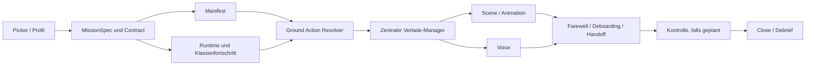

# Mission Flow Reference

## Generieren → lokaler Entwurf → akzeptieren → beginnen (08.10.2026)

Der vollständige Ablauf und Fehlergrenzen stehen im
[Mission Runtime Authority Contract](Mission%20Runtime%20Authority%20Contract.md).
Generieren ist eine lokale Vorschau und lässt den angenommenen Cloud-/Tracker-
Auftrag bestehen. Erst bestätigtes Akzeptieren beendet und ersetzt den alten
Auftrag; Start/Boarding bleiben ein eigener Schritt. Ablehnen verwirft nur die
Vorschau und lädt den angenommenen Stand. Clear warnt und bereinigt den
Missionsslot, ohne Logbuch und weitere Profilfelder zu löschen.


## Periodische RAM-Sicherung, Alpha v428 (17.09.2026)

Diese Regel ersetzt fuer den Missions-Kindprozess die oben beschriebenen
synchronen Dateischreibvorgaenge vor jedem Commit. Die fachliche Authority lebt
im RAM. Ein erfolgreiches Intent-ACK bestaetigt den RAM-Commit, nicht bereits
seine Sicherung auf Platte. EFB/Relay erhalten weiterhin aktuelle RAM-Projektionen.

Ein einzelner asynchroner Writer sichert bei Aenderungen alle fuenf Sekunden den
aktuellen Gesamtzustand einschliesslich Manifest, Effekten, Authority und Journal.
Weitere Klicks verschieben den Takt nicht. Waehrend einer langsamen Speicherung
werden keine alten Sicherungen aufgereiht; der neueste Stand bleibt als dirty
markiert. Temp-Datei und anschliessendes Rename erhalten bei Fehlern die vorige
lesbare Sicherung. Fehler blockieren keine Cargo-Aktion; der naechste Takt
versucht den aktuellen Stand erneut. Normaler Shutdown flusht mit der bestehenden
begrenzten Prozesswartezeit. Ein harter Abbruch kann seit der letzten erfolgreichen
Sicherung bestaetigte Aenderungen verlieren. Fuenf Sekunden sind das Zielintervall,
keine Garantie bei blockiertem Loop, langsamer Platte oder Schreibfehlern.

JSON-Capture erfolgt konsistent ohne await einmal je Sicherung im Missionsloop;
die Datei-I/O danach asynchron. JSON-Aufbereitung kann daher weiterhin periodische
CPU-Spitzen verursachen. Die reine Disk-Rollback-Gesamtkopie pro Execution-Event
entfaellt in diesem Modus. Validierung, Replay-Grenzen und semantische Guards
bleiben erhalten. Standalone-/Legacy-Authority ohne Worker bleibt unveraendert.

Beim Neustart ersetzt Cargo-Recovery offene historische Cargo-Objektwirkungen
durch den aktuellen gespeicherten Sollzustand. Beim ersten gueltigen Sim-Stand
werden geladene Objekte entfernt, ausgeladene an gespeicherten Koordinaten
wiederhergestellt (ohne Koordinaten am aktuellen Standort) und anstehende
Start-/Pickup-Fracht in der passenden Phase aufgebaut. Payload wird anhand des
aktuellen Manifests abgeglichen. Diese Projektion aendert das Manifest nicht und
loest keine neuen Cargo-Sprachansagen aus. PAX und andere Missionswirkungen
behalten ihre vorhandene Recovery. Neue Klicks verwenden dieselbe Originalqueue
und koennen einen aelteren Recovery-Sollzustand abloesen. Simulatorfehler bleiben
best effort und werden protokolliert; es gibt kein neues blockierendes Recovery-ACK.

`MISSION_PROCESS_COST.persistence` meldet mode, intervalMs, revision,
savedRevision, dirty, writing, lastSavedAt und Kosten/Fehler. `MISSION_CHECKPOINT_ERROR`
zeigt Sicherungsfehler; `MISSION_CARGO_CHECKPOINT_RECOVERY` und
`MISSION_CARGO_RECOVERY_ACK` dokumentieren den Abgleich.


## Cargo-Ausfuehrung nach Original-App-Modell (17.09.2026)

Die fachliche Referenz bleibt `mission-cargo-core.js` mit dem bereits von App
und Tracker verwendeten `mission-manifest-core.js`. Die originale sichtbare
Objektsteuerung (Queue, Flush, ACK, Cancel) wird durch
`tools/extract-cargo-visual-queue.cjs` browserunabhaengig extrahiert; der Build
prueft Quellgleichheit. Eingefrorene Referenz: Tracker-Fixture
`standalone-cargo-visual-queue-v423.txt`. Identische Klickfolgen und spaete ACKs
werden gegen den Originalcode verglichen. Auch die Original-App hat 180 ms
Debounce; dieser Wert ist kein alleiniger Erklaerungsgrund fuer die Regression.

Nach einem gueltig persistierten Cargo-Intent startet der Tracker seine neuen
Objektaktionen unmittelbar, ohne auf den allgemeinen Effekt-Drain zu warten.
Die Originalqueue fasst pro Objekt den gewuenschten Zustand zusammen und wartet
nicht auf vorherige Simulator-ACKs. Objektrevisionen verhindern, dass spaete
Spawns neuere Loeschauftraege rueckgaengig machen. Allgemeiner Drain und direkter
Start teilen dieselben Dispatch-Reservierungen und Wiederanlauf-Effekte.
Payload und Voice bleiben unabhaengige Hintergrundarbeiten. Keine zweite
fachliche Authority und keine optimistische Manifestmutation in App/EFB.

Die komplette Authority-Persistenz bleibt vor Bestaetigung erhalten. Deshalb
ist mit dieser Umstellung keine garantierte Millisekunden-Latenz behauptet.
`MISSION_CARGO_DIRECT` trennt Commit und Start, `MISSION_CARGO_VISUAL` misst
die reale Wartezeit der Originalqueue. Windows-/MSFS-Vergleich bleibt noetig.


## Reset-Korrektur v423 (16.09.2026)

Expliziter Benutzer-Reset darf an Payload-Fehlern nicht haengen. Baseline-Restore
mit kurzen Lese-Fristen, danach einmal Standardstationen auf 0; Fehler sind
Warnungen. Ohne Sim-Verbindung wird Payload uebersprungen. Szenenbereinigung
und persistente Authority-Freigabe bleiben geprueft. Abgebrochene Payload-
Vorbereitung darf spaeter keine neue Beladung mehr schreiben. App wiederholt
nach bestaetigtem Tracker-Abbruch keine Payload-Bereinigung; Clear-all erzeugt
keinen zusaetzlichen Burst aus gespeicherten Szene-IDs. HTTP-Revisionskonflikte
liefern den aktuellen Snapshot direkt fuer den einmaligen Client-Retry.
Telemetrie-Revisionen waehrend eines bereits angenommenen Resets verhindern
nicht dessen Abschluss; Missions-/Run-Identitaet wird weiterhin geprueft.
Die allgemeinen EFB-Hauptschleifenverzoegerungen sind damit nicht als behoben
nachgewiesen. Payload-Timeouts enthalten Request-ID und tatsaechliche Dauer.


Lokal ergänzter Vereins-KI-Pfad: [Vereins-/Utility-Ideen V1](Mission%20Club%20Utility%20Ideas%20V1.md). Vor dem Picker optional regionale Eventsuche, anschließend drei strukturierte Ideen in einem Aufruf, nach Auswahl ein Writer. A-B-Runtime bleibt bestehen; persönliches Gepäck und Pflichtlieferung werden im Manifest ausdrücklich unterschieden. Kein Pickup-Ausbau.

Aktueller konsolidierter Stand und Übertragung auf weitere Sets: [Missionssets-Arbeitsgrundlage](Mission%20Sets%20Handoff.md) (15.09.2026).

Fuer die Verschiebung dieser Ablaeufe zwischen App und Tracker gilt zusaetzlich
der verbindliche `Mission Runtime Authority Contract.md`. Die hier
beschriebenen Regeln duerfen im Tracker nicht vereinfacht oder angenaehert
nachgebaut werden.

Stand: 10.08.2026

Diese Datei ist die kurze operative Referenz fuer den aktuellen Missionsablauf.
Sie beantwortet zuerst:

- Welche Ablaufklasse verwendet eine Mission?
- Welche Aktion ist am Start, Ziel und Abschluss erlaubt?
- Welche Ladung, Unterschrift und Bestaetigung blockiert den naechsten Schritt?
- Wann duerfen Voice und Animation starten?
- Welche Datei besitzt die jeweilige Entscheidung?

Die ausfuehrlichen Regeln bleiben in:

- `docs/Mission Semantics Rules V4.md` fuer fachliche Bedeutung und Drift-Guardrails
- `docs/Mission Building Instructions.md` fuer Aufbau und Erweiterung
- `docs/Mission Test Strategy.md` fuer Testtiefe und Nachweise

Bei Widerspruechen gilt: Semantik bestimmt das fachliche Rezept; Core-Code und
Selftests muessen diesen Vertrag ausfuehren. Diese Referenz muss bei jeder
Ablaufaenderung mit aktualisiert werden.

## 1. Architektur in einem Bild


```mermaid
flowchart LR
    A["Picker / Profil"] --> B["MissionSpec und Contract"]
    B --> C["Manifest"]
    B --> D["Runtime und Klassenfortschritt"]
    C --> E["Ground Action Resolver"]
    D --> E
    E --> F["Zentraler Verlade-Manager"]
    F --> G["Scene / Animation"]
    F --> H["Voice"]
    G --> I["Farewell / Deboarding / Handoff"]
    H --> I
    I --> J["Kontrolle, falls geplant"]
    J --> K["Close / Debrief"]
```

Verantwortlichkeiten:

| Schicht | Aufgabe | Darf nicht |
| --- | --- | --- |
| Profil / MissionSpec | Ablaufklasse und Missionsparameter festlegen | UI-Sonderpfade starten |
| Contract / MissionTruth | Auftrag, Ziel und Rollen stabil halten | Runtime-Zustand verstecken |
| Manifest | PAX, Fracht, Bordbestand und Lieferort beschreiben | Missionsphasen frei erfinden |
| Runtime / Fortschritt | erlaubten naechsten Zustand bestimmen | Voice als State Machine benutzen |
| Ground Action Resolver | `load`, `pickup`, `unload`, `end` oder `none` liefern | Dialoge selbst abschliessen |
| Verlade-Manager | Items, Signatur und Bestaetigung als Gates ausfuehren | Erfolg ohne Core-Gates freigeben |
| Scene / Voice | sichtbaren und erzaehlerischen Ablauf darstellen | fachlichen Missionserfolg setzen |

### 1.1 Private Generierung vor dem Missionsstart (V6.3)

Release dieser Erweiterung: App-Cache `ga-dispatcher-v1760`, Tracker Alpha v404.
Der private KI-Picker verwendet dieselben Ideenregeln wie der direkte private
Dispatch. Der Ablauf vor `planned` ist:

1. Die Flugplatzsuche bestimmt drei Kandidaten nach ihren bestehenden Suchregeln.
2. Begrenzter Ortskontext wird parallel für die drei Ziele geladen.
3. Ein gemeinsamer KI-Aufruf erzeugt drei vollständige strukturierte Ideen.
   Die bisherige Entwurfshistory wird einmal als Varianzkontext mitgegeben.
4. Die Karten zeigen Anlass, Begleitung, Gepäck und Strecke. Ihre Snapshots halten
   die jeweilige Idee und die zugehörigen Ortsbelege mit stabilen IDs fest.
5. Die Auswahl übernimmt genau diesen Ideenvertrag. Start-/Zielbezug und Vertrag
   werden erneut geprüft; unpassende oder ungültige Auswahlen stoppen sichtbar.
6. Der technische V4-Rahmen liefert aktuelle Flug-/Wetterdaten. Der private Writer
   schreibt aus der gewählten Idee direkt das Briefing, ohne erneute Ideenplanung.
7. Nur die fertig ausgearbeitete Auswahl ergänzt die lokale Entwurfshistory.
   Die beiden anderen Angebote erzeugen keine Erinnerung. Auch der gespeicherte
   Briefingentwurf belegt keinen begonnenen oder abgeschlossenen Flug.

Der private Erzählpfad benötigt damit einen Batch-Aufruf und einen Writer-Aufruf;
technischer Planner und bestehende Provider-Fallbacks kommen gegebenenfalls hinzu.
V5 und ausgeschaltete KI behalten ihre bisherigen Auswahlpfade. Der Picker
verändert keine Boarding-, Manifest- oder Abschluss-Gates.

Vertrag, Kosten und Testnachweise:
[Mission Narrative Design Guide, Abschnitt 11](Mission%20Narrative%20Design%20Guide.md#11-v63--drei-geplante-privatmissionen-zur-auswahl).

### Gemischte PICK-Auswahl bei APT all / POI all

Bei generischer Auto-Auswahl stellt PICK bis zu drei unterschiedliche unterstützte
Missionsprofile zusammen. APT bevorzugt dabei unterschiedliche Kategorien.
Die bestehende Flugzeug-Profilmatrix und Passagierkapazität begrenzen den Pool.
Jedes POI-Profil bestimmt seine eigene passende Zielkategorie. Konkrete
Picker-Auswahlen behalten ihren bisherigen Generator mit drei Varianten.

Die bestehenden Vorschlagsgeneratoren liefern unveränderte Ideen-Snapshots;
die gewählte Karte behält Profil, Ziel und Ideenvertrag für den späteren Writer.
Leere oder fehlgeschlagene Profilsuchen werden durch weitere Profile ersetzt.
Reichen die erfolgreichen Profile nicht aus, werden weitere Varianten aus deren
bereits erzeugten Vorschlägen ergänzt. Nicht PICK-fähige Profile werden nicht
in die gemischte Auswahl aufgenommen; ohne passenden Pool gilt der bisherige
Dispatch-Pfad. Abbruchsignale werden weitergereicht.

KI-Generatoren können pro Profil weiterhin einen eigenen Dreierbatch erzeugen;
daher kann eine gemischte Auswahl mehrere KI-Aufrufe benötigen. Prompts,
Missionsverträge und Runtime bleiben unverändert.

### 1.2 Private Heimreise V1

Implementiert ist eine optionale zweite APT-Mission `B -> A` nach erfolgreichem
Abschluss des privaten Hinflugs `A -> B`. Das sofort verfügbare Folgeangebot
startet keinen Flug automatisch. Seine Annahme bildet den erzählerischen Sprung
über den Aufenthalt; eine reale Wartezeit oder eine simulierte Bodenaktivität
ist dafür nicht erforderlich. Zeitgebundene Vorhaben und Übernachtungen müssen
dabei ihren geplanten zeitlichen Bezug behalten.

Der Hinflug bleibt bis zu seinem Abschluss eine Vorschau auf den Ausflug.
Erst die angenommene Heimreise erhält einen gemeinsam genutzten, strukturierten
Erlebnisrückblick für Briefing und Voice. Begleitung, Beziehung, ursprünglicher
Anlass und Ort bleiben erhalten; die Route führt vom besuchten Platz zum
ursprünglichen Startplatz. Strecke und Wetter werden neu ermittelt.

Die Heimreise nutzt die normalen APT-Start-/Abschluss-Gates. Sie erzeugt keine
weitere private Rückflugkette. Ein Entwurf, Abbruch, anderer Landeort oder ein
wiederholter Abschluss-/Restore-Hook darf kein neues Erlebnis beziehungsweise
doppeltes Folgeangebot erzeugen. Die privaten Adapter verwenden den bestehenden Follow-up-/Sync-Pfad.
Triggervergleich und Nachweise stehen in [Private Return V1](Mission%20Private%20Return%20V1.md).

Konzept und Abgrenzung:
[Mission Narrative Design Guide, Abschnitt 12](Mission%20Narrative%20Design%20Guide.md#12-private-heimreise-als-fortsetzung).

## 2. Universeller Start

Jede echte Mission verwendet dieselbe Startkette:

1. `planned`
2. Mission beginnen fordert `prepare` an.
3. Startszene wird am Flugzeug erzeugt.
4. Der zentrale Verlade-Manager zeigt Missionsladung und Bordbestand.
5. PAX steigt ueber den Boarding-Ablauf ein; Fracht wird in der Liste geladen.
6. Alle Pflichtpositionen des Start-Legs sind geladen.
7. Pilot unterschreibt die Frachtgutliste mit Scope `departure`.
8. Pilot bestaetigt die Verladung.
9. Boarding-Animation und Boarding-Voice sind abgeschlossen.
10. `boarded -> active`; erst jetzt ist der Flug freigegeben.

Startbanner und Boardbuchbanner sind Bedienhilfen. Sie ersetzen kein Runtime-
oder Manifest-Gate.

## 3. Der zentrale Verlade-Manager

Der Verlade-Manager ist die einzige zentrale Bedienoberflaeche fuer
Missionsladung. Alte separate Ankunfts-, Entlade- oder Pickup-Dialoge duerfen
keine zweite Abschlusslogik mehr bilden.

### 3.1 Gate-Matrix

| Modus | Sichtbare Positionen | Pflicht-Gate | Signatur-Scope | Separate Bestaetigung bewirkt |
| --- | --- | --- | --- | --- |
| `load` | Startladung, Start-PAX, Bordbestand | alle Start-Pflichtpositionen geladen | `departure` | Startverladung abgeschlossen |
| `pickup` | Ziel-PAX und/oder Ziel-Fracht | alle Ziel-Pflichtpositionen geladen | `pickup` | Pickup abgeschlossen, `return_leg` freigegeben |
| `unload` | geladene Zielladung, PAX, Bordbestand | alle hier abzuliefernden Pflicht-Cargo-Items entladen | `arrival` | Farewell/Deboarding oder Missionsende freigegeben |
| `equipment` | Bordbuch, Verbandzeug, Feuerloescher, Radkeile | kein Missionsfortschritt | keine | Fenster schliessen |

Fuer `load`, `pickup` und `unload` gilt immer:

1. Items bearbeiten.
2. Unterschreiben.
3. Signaturanimation abwarten.
4. Mit einem zweiten Klick bestaetigen.

Eine Item-Aenderung nach der Unterschrift loescht die Signatur wieder. Eine
Start-, Pickup- oder Ankunftsunterschrift kann wegen der getrennten Scopes
niemals eine andere Station freigeben.

### 3.2 Pickup im Detail

Passenger-Pickup:

1. Am Zielpunkt stillstehen.
2. Verlade-Manager im Modus `pickup` oeffnen.
3. PAX-Zeile anklicken; Boarding-Animation abwarten.
4. Begleitfracht anklicken und laden.
5. Erst wenn beide Pflichtpositionen an Bord sind, wird die Pickup-Unterschrift
   freigegeben.
6. Mit Scope `pickup` unterschreiben.
7. Danach `Pickup bestaetigen und Rueckflug freigeben` anklicken.
8. Fortschritt setzt `pickupCompleted`, `pickupConfirmed` und `return_leg`.

Die wartende Person bleibt fachlich Teil der APT-/Strip-Arrival-Szene, wird in
der an den Tracker gesendeten Szene aber als `person_boarder_1` markiert. Nur
so darf der zentrale Pickup-Klick die sichtbare Person in die bestehende
`mission_scene_boarding`-Animation uebernehmen. Normale Empfangskontakte
bleiben `arrival_person_*` und koennen nicht versehentlich einsteigen.

Cargo-Pickup verwendet denselben Ablauf ohne PAX-Boarding. Die Fracht bleibt
bis zum Home-Unload Pflichtladung.

Auch ein am Start wirklich leerer Pickup-Hinflug durchlaeuft den Modus `load`.
Es gibt dabei keine Startladung anzuklicken, aber die leere Abflugliste wird
wie bei jeder anderen Mission unterschrieben und mit dem zweiten Klick
bestaetigt. Pickup-Missionen besitzen keinen separaten Start-Shortcut.

## 4. Ablaufklassen

Profile veraendern Story, Rolle, Ziel, Manifest und Szene. Eine neue
Ablaufklasse ist nur noetig, wenn sich die fachlichen Gates aendern.

Charter, Private Outing und Sightseeing duerfen bei ausgehandelter
`mission.scene.group.v1`-Capability eine Party von zwei bis fuenf Personen
erzeugen, begrenzt durch die Passagierplaetze des bei der Erzeugung aktiven
Presets. `party.count` und `passengerCount` muessen identisch bleiben; die
benannte Hauptperson bleibt die einzige Voice-Persona. Die Gruppe ist ein
atomarer Passenger-Manifest-Eintrag und erzeugt keine neue Ablaufklasse.
Utility und Cargo erhalten durch diese Regel keine Gruppenvariante. Ohne
Capability gilt der bestehende Einzelpersonenpfad.

| Ablaufklasse | Referenzprofile | Zielaktion | Rueckflug | Abschluss |
| --- | --- | --- | --- | --- |
| APT Arrival | Charter, Privat, Cargo, Medical, Tiertransport | Landung am Zielflugplatz | nein | Ziel-Unload/Signatur, Farewell/Deboarding, Close |
| POI On-Task | Inspection, Foto, Survey, Sightseeing, Fire Watch, SAR | Task in Radius/Hoehe/Dwell oder Pattern | optional | definierter Abschlussort, Unload/Signatur, Farewell, Close |
| Bush Strip Target | `bush_supply_strip`, `bush_charter_strip`, `bush_scenic_hopper` | Landung und ggf. Unload/Dropoff am Strip | nein | Ziel-Unload/Signatur oder Landebestaetigung, Close |
| Pickup Return Passenger | `bush_pickup_strip`, `apt_charter_pickup` Follow-up | PAX plus Begleitfracht am Ziel laden | ja | Home-Unload/Signatur, Farewell/Deboarding, Close |
| Pickup Return Cargo | `bush_pickup_cargo` | Rueckholfracht am Ziel laden | ja | Home-Unload/Signatur, Close |
| POI Return Home | `bush_recon_return` und andere RTB-POI-Rezepte | Air-Task, keine Ziel-Landung als Erfolg | ja | Home-Unload/Signatur, Farewell, Close |

### 4.1 APT Arrival

Grundform: `A -> B`

```text
departure load/sign/confirm
-> boarding complete
-> active flight
-> touchdown/ground still
-> arrival banner
-> unload/sign/confirm
-> farewell and deboarding
-> optional inspection
-> close
```

Regeln:

- Das Verladefenster oeffnet nach der Landung nicht automatisch; der Pilot soll
  beim Rollen die Karte sehen.
- Der PAX-Klick im Verlade-Manager kann Deboarding vorbereiten. Der fachliche
  Abschluss bleibt an Pflicht-Cargo, Ankunftssignatur und Bestaetigung gebunden.
- Eine APT-Arrival-Szene konkretisiert den Handoff, erzeugt aber keinen zweiten
  Missionsabschluss.

### 4.2 POI On-Task

Grundform: `A -> B (Task)` oder `A -> B (Task) -> A`

```text
start
-> enroute
-> target radius / altitude / dwell / pattern
-> on_task complete
-> optional return_leg
-> ground at defined finish
-> unload/sign/confirm
-> farewell
-> close
```

Regeln:

- Landen am POI ersetzt die Task-Erfuellung nicht.
- Pflicht-Missionsfracht wird am tatsaechlichen Abschlussort entladen.
- Fire Watch, SAR, Survey und Training sind Unterrezepte, keine eigenen
  parallelen Abschlussmaschinen.

### 4.3 Bush Strip Target

Grundform: `A -> B`

- `bush_supply_strip`: Pflichtfracht am Zielstrip entladen.
- `bush_charter_strip`: PAX am Ziel verabschieden.
- `bush_scenic_hopper`: Landung am Ziel ist der Missionskern; kein kuenstlicher
  Return-Leg.

Alle drei verwenden die zentralen Ankunfts- und Verlade-Gates. Bush-Atmosphaere
allein rechtfertigt keinen abweichenden Close-Pfad.

### 4.4 Pickup Return

Grundform: `A -> B (Landung und Pickup) -> A`

```text
empty outbound
-> pickup_ready
-> pickup manager
-> target items loaded
-> pickup signature
-> pickup confirmation
-> return_leg
-> home_unloading
-> arrival signature and confirmation
-> farewell/deboarding if PAX
-> optional inspection
-> close
```

Szenen- und Zielregeln:

- Der leere Hinflug erzeugt am Start keine dekorative Fahrzeug-/Crew-Szene.
  Dispatch-Liste, Signatur und Startbestaetigung bleiben davon unberuehrt.
- Die Abholszene wird erst im Zielanflug vorgestaged. Nach Pickup-Signatur und
  -Bestaetigung ist sie terminal beendet; ein GPS-Tick darf sie weder komplett
  noch teilweise erneut spawnen.
- Am Strip muss sich die Abstellseite aus einer vorhandenen Runway-Geometrie
  ableiten. Der Streckenkurs zum Platz ist kein Runway-Heading.
- Ab `return_leg` ist der Heimatplatz das einzige Runtime-Ziel. Der alte
  Pickup-Anker darf weder Landeerkennung noch Off-Destination-Voice steuern.
- Ein Pickup-Passagier bleibt im Manifest `loaded`, bis Farewell und die
  koordinierte Deboarding-Sequenz ihn aussteigen lassen. Manueller Unload am
  gueltigen Heimat-Endpunkt darf keinen statischen Ersatz-PAX spawnen.

Verboten:

- Rueckflug vor Pickup-Signatur und Bestaetigung
- Abschluss am Pickup-Punkt
- Home-Abschluss mit noch geladener Pflichtfracht
- Wiederverwendung der `departure`-Signatur als Pickup-Signatur
- separates altes PAX-Popup als zweiter Pickup-Controller

### 4.5 Bush Recon / POI Return Home

Grundform: `A -> B (Task ohne Landung) -> A`

- Das Ziel ist Arbeitsgebiet, kein Pickup-Punkt.
- Task-Erfuellung folgt der POI-Logik.
- Erst danach wird `return_leg` aktiv.
- Pflichtfracht wird zuhause entladen und die Ankunft unterschrieben.

## 5. Farewell, Deboarding und Kontrolle

Reihenfolge am Missionsende:

1. Pflicht-Cargo ist entladen.
2. Ankunftsliste ist unterschrieben und bestaetigt.
3. Farewell-Audio wird gestartet oder aus dem Preload abgespielt.
4. Deboarding darf parallel vorbereitet werden, wartet fachlich aber auf die
   Farewell-Freigabe.
5. Eine geplante Behoerdenkontrolle wartet mit ihrer Ansage bis Farewell fertig
   ist.
6. Kontrolleure pruefen ausgeladene Nachweise und Bordbuch.
7. Erst nach abgeschlossenem Kontrollpfad wird Close freigegeben.

Voice-Queues mit Lande- oder Zielansagen muessen beim Beginn von Farewell oder
End-Lock abbrechen. Eine verspaetete Netzantwort darf nicht nach dem Farewell
noch eine Landeansage abspielen.

Standard-A–B: Neben dem normalen 4-NM-Anflugtrigger prueft der Tracker wie
Standalone beim ersten langsamen Landekandidaten den 4,5-NM-Fallback
(aktiver Flugrecorder, vorherige Airborne-Phase, unter 18 kt und unter
140 ft AGL). Beide Wege nutzen denselben einmaligen Anflugeffekt und
2 Sekunden Vorlauf. Pause/Menu verbrauchen keinen neuen Landekandidaten.

Die zufaellige Kontrollwahrscheinlichkeit steht waehrend der manuellen
Testphase auf `0 %`; Debug-Forcing bleibt erlaubt.

## 6. Bordbestand und Boardbuch

Bordbuch, Verbandzeug, Feuerloescher und Radkeile sind keine Pflichtausstattung.
Vergessen oder Verlust bleibt moeglich und kann bei einer Kontrolle Folgen
haben.

- Bordbestand kann am Boden und im Stillstand ueber `equipment` verwaltet
  werden, auch ohne Mission.
- Ausgeladene Ablauf-Items zeigen ihr Datum.
- Austausch ist nur innerhalb des erlaubten Zeitfensters und nicht waehrend
  einer Kontrolle moeglich.
- Das Bordbuch bleibt geladen beschreibbar.
- Start- und Landezeitbanner sind Abkuerzungen zum selben Logbuchzustand.
- Am Boden zurueckgelassene Items werden nach Abflug als verloren markiert.

### 6.1 Flugaufzeichnung, Zwischenlandung und Debrief

- Der aktive Flight-Recorder beschreibt immer genau einen Flugabschnitt.
- Nach Touchdown bleibt dieser Abschnitt fuer Farewell eingefroren. Erst nach
  fuenf Sekunden stabilem Halt wird er abgeschlossen und ein neuer
  Segmentrecorder freigegeben.
- Ein Zwischenhalt loescht nie die vorherigen Flugwerte. Der Tracker fuehrt
  parallel einen missionsweiten Record aus allen abgeschlossenen Segmenten und
  dem noch offenen letzten Segment.
- Farewell beurteilt die letzte Ankunft. Das finale Debrief verwendet den
  missionsweiten Record mit gesamter Flugzeit, Strecke, Extremwerten und
  Stichprobenzahl.
- Rohtelemetrie wird im Tracker append-only lokal gespeichert. Authority,
  App/EFB-Snapshots und Cloud erhalten nur begrenzte Zustands- beziehungsweise
  Abschlussmodelle; `localStorage` ist kein Flightlog-Rohdatenspeicher.

## 7. Wiederherstellung und Sackgassen-Schutz

- Missionsentwuerfe und akzeptierte, noch nicht begonnene Missionen bleiben
  lokal erhalten und werden bei aktivem Auto-Sync in den aktiven Cloud-Slot
  geschrieben. Ein Cloud-Restore darf den Draft-Status nicht automatisch als
  Missionsstart behandeln.
- Ein ausstehender Missions-Upload wird lokal markiert. Nach Neustart oder
  erneutem Sichtbarwerden wird dieser lokale Stand vor einem Cloud-Pull erneut
  hochgeladen; der lokale Sync-Zeitstempel wird erst nach bestaetigter
  Serverantwort fortgeschrieben.
- Der erzwungene App-Update-Pfad speichert zuerst den aktuellen In-Memory-Stand
  und versucht dann einen bestaetigten Cloud-Upload, bevor Service Worker und
  Caches entfernt werden.
- Nur der Laufstand einer wirklich begonnenen, noch nicht beendeten Mission
  verfaellt 12 Stunden nach Missionsstart. Auftrag, Briefing, Route, Passagier
  und Vertrag bleiben erhalten; Flug-, Boarding-, Cargo-, Bush-, SAR- und
  POI-Fortschritt werden sauber zurueckgesetzt und die Mission faellt auf
  `planned` zurueck. Dieser geplante Stand wird wieder in die Cloud geschrieben.
  Geplante, akzeptierte oder als Draft gespeicherte Missionen besitzen keine
  solche Altersgrenze. Ein bereits abgeschlossener Stand mit ausstehendem
  Debrief wird nicht auf geplant zurueckgesetzt.
- Das Schliessen des Verlade-Managers verwirft keinen Item- oder Signaturstatus.
- Fehlende Pflichtpositionen halten nur den naechsten Gate geschlossen.
- Eine geloeschte Signatur kann erneut gesetzt werden.
- Ein verpasster Pickup-Abschluss bleibt ueber den Ground Action Resolver
  erreichbar.
- Alte Passenger-Pickup-Manifeste werden um Begleitfracht erweitert. Ist der
  Pickup bereits geladen oder abgeschlossen, wird die Migration passend zum
  vorhandenen Zustand ausgefuehrt, damit keine unerfuellbare Bedingung entsteht.
- Eine ausdruecklich bestaetigte Tracker-Geraeteuebergabe restauriert den
  autoritativen Runtime-, Boarding- und Manifeststand auch dann, wenn dieses
  Geraet die Mission zuvor bewusst als frischen Start geoeffnet hatte. Der
  lokale Fresh-Start-Schutz darf nur automatische lokale Restores blockieren.
- Ein Cloud-Pull darf einen aktiven Tracker-Run weder ersetzen noch loeschen.
  Beim manuellen Pull werden die nicht missionsbezogenen Profildaten normal
  geladen; Mission, Phase und Fortschritt kommen danach ausschliesslich aus
  dem bestaetigten Tracker-Resume-Bundle. Auch eine gleich benannte
  Cloud-Mission ist dabei nur ein Hinweis auf die Identitaet, keine zweite
  Runtime-Wahrheit.
- Weicht die Cloud-Missions-ID vom aktiven Tracker-Run ab, bleibt die
  Cloud-Kopie gesperrt und der Pull bietet die ausdrueckliche
  Tracker-Geraeteuebergabe an. Ein stiller Pull darf diese Uebergabe niemals
  selbst bestaetigen; er aktualisiert nur die uebrigen Cloud-Daten und behaelt
  den Tracker-Run als aktive Mission bei.
- Nach einer Geraeteuebergabe wird der bisherige Owner zum Beobachter. ACKs und
  Snapshot-Schreibversuche anderer Clients duerfen seinen lokalen Missionsstand
  nicht mehr fortschalten oder wieder zum Tracker zurueckschreiben.
- Ein durch alte Szenenbefehle implizit angelegter `legacy-client`-Run kann noch
  keinen Resume-v2-Snapshot besitzen. In diesem Sonderfall darf eine Web-App
  nach ausdruecklicher Bestaetigung genau dann einen Rettungsstand setzen, wenn
  ihre lokale Missions-ID exakt der Tracker-Missions-ID entspricht. Die
  Reihenfolge ist verbindlich: Owner uebernehmen, vollstaendiges Resume-Bundle
  als bestaetigten `mission_snapshot_update` schreiben, erst danach die
  Uebergabe lokal abschliessen. Eine andere Mission oder ein fremder
  versionierter Owner bleibt gesperrt.
- Sim- und Live-Modus verwenden dieselben fachlichen Gates. Nur Scene-ACK,
  Telemetriequelle und sichtbare Animation unterscheiden sich.
- Der vorbereitete Tracker-APT-Pfad darf keine zweite Szenenentscheidung
  erzeugen. `ga.mission-apt-effect-plan.v1` wird aus denselben Spawn- und
  Boarding-Buildern wie der aktive Web-Pfad erzeugt; der Tracker ersetzt beim
  Effekt nur aktuelle Simposition, Run und deterministische Command-ID.
- Ein Tracker-Execution-Effekt darf den fachlichen Zustand erst nach dem echten
  ACK des bestehenden Simulatorhandlers fortschalten. Fehlender Plan,
  `no_scene`, `busy`, `noop` oder ein SimConnect-Fehler sind kein Boarding-
  beziehungsweise Prepare-Erfolg.
- APT-Zielradien verwenden standardmaessig 0,16 NM am Arrival-Anker, 0,35 NM
  am Airport-Fallback und 1,2 NM am routenbasierten Ziel. Abweichungen duerfen
  nur als vollstaendige `ga.mission-location-policy.apt.v1` innerhalb der im
  Location-Core definierten Grenzen transportiert werden. POI-/Sonderzonen
  sind eigene Rezepte und keine vergroesserten APT-Radien.

## 8. Code-Eigentuemer

| Thema | Primaere Datei |
| --- | --- |
| Profil und Bush-Rezept | `mission-definition-core.js` |
| Missionsemantik und Contract-Hydration | `app.js` |
| Transportneutrale Manifest-, Signatur-, Cargo-, Bordbuch- und Ablauf-Equipment-Gates | `mission-manifest-core.js` |
| Transportneutrale Payloadplanung, Readback, begrenzte Live-W&B-Projektion und Abort-/Reset-Rueckbau | `mission-payload-core.js` |
| Manifest-Erzeugung, Verlade-Manager, Payload und Cargo-Seiteneffekte | `mission-cargo-core.js` |
| Runtime und Ground Readiness | `mission-runtime-core.js` |
| Gemeinsame APT-Zielradien und Distanzentscheidung | `mission-location-core.js` |
| UI-Orchestrierung, Scene Commands, Mission Lifecycle | `sync.js` |
| APT-/Pickup-Ankunftsrollen | `mission-arrival-core.js` |
| PAX-Text, TTS, Voice-Queue | `passenger-voice.js` |
| Tracker-Animation und SimObjects | `ga-tracker-client/tracker.js` |
| Tracker-APT-Intent-/Effekt-Orchestrierung | `ga-tracker-client/tracker-mission-execution-runtime.js` |
| Tracker-Payload-Write, private Baseline und Rueckbau | `ga-tracker-client/tracker-mission-payload-handler.js` |
| Gemeinsame APT-Banner-, Frachtlisten-, Signatur-, Label- und Cargo-Aktionsprojektion | `mission-apt-ui-core.js` |
| Segment- und Missionsflugaggregate | `mission-flight-recorder-core.js` |
| Lokaler append-only Tracker-Flightlog | `ga-tracker-client/tracker-flight-log-store.js` |
| Validierung vorbereiteter APT-Szeneneffekte | `ga-tracker-client/tracker-mission-simulator-effects.js` |

Fachliche Manifest-, Itemtransition-, Signatur- und Cargo-Gates gehoeren in
`mission-manifest-core.js`. `mission-cargo-core.js` erzeugt und persistiert das
Manifest und fuehrt die bestehenden Payload-, Audio-, SimObject-, Animations-
und UI-Seiteneffekte aus. `sync.js` verbindet UI und Ereignisse. Voice und
Tracker duerfen den fachlichen Erfolg nicht eigenstaendig setzen.

`mission-apt-ui-core.js` entscheidet ausschliesslich, wie ein bereits
autoritativ bestimmter APT-Zustand in App, EFB oder spaeter Toolbar-Panel
erscheint. Die Standard-APT-Frachtgutliste wird als
`app-cargo-dialog-v1` mit denselben Itemstatus-, Signatur-, Summen- und
Buttontexten projiziert. Dazu gehoeren Bordbuch-/Ablauf-Equipment-Aktionen,
profilabhaengige Pickup-Texte und die begrenzte Live-Weight-&-Balance-
Zusammenfassung. Dadurch darf kein Client aus einem sichtbaren Button selbst
auf Missionserfolg oder eine Cargo-Transition schliessen. Reine Fracht-
Pickups koennen der Tracker-Core und sein Adapter bereits bestaetigen;
Passenger-Pickup bleibt bis zum gemeinsamen Boarding-Szenenrezept gesperrt.
Compliance bleibt bis zur Extraktion seiner Ground-Visit-, Voice-, Evidence-,
Remediation- und Sanktionskette fail-closed.

## 9. Pflichtnachweis bei Ablaufaenderungen

Mindestens:

```bash
node --check app.js
node --check mission-manifest-core.js
node --check mission-cargo-core.js
node --check mission-location-core.js
node --check mission-runtime-core.js
node --check passenger-voice.js
node --check sync.js
node tools/mission-flow-simulation-selftest.mjs
node tools/mission-ground-flow-selftest.mjs
node tools/mission-cargo-persistence-selftest.mjs
node --test mission-manifest-core.test.js
node --test mission-payload-core.test.js ga-tracker-client/tracker-mission-payload-handler.test.js
node tools/mission-payload-app-differential-selftest.mjs
node tools/mission-update-sync-selftest.mjs
node --test mission-location-core.test.js
```

Bei Profil-, Contract- oder Szenenaenderungen zusaetzlich einen erzwungenen
Pipeline-Dryrun fuer das Referenzprofil ausfuehren. Ein echter Sim-Test bleibt
fuer Telemetrie, Audio-Timing, Modell-Ladezeit und Animation erforderlich.

## 10. Aenderungsregel

Wenn ein Missionsablauf geaendert wird, muessen im selben Patch geprueft werden:

1. diese Flow-Referenz,
2. die passende Rezeptstelle in `Mission Building Instructions`,
3. mindestens ein State-Flow-Selftest,
4. Restore/Migration bei neuen Pflicht-Gates,
5. Sim- und Live-Pfad,
6. Voice- und Scene-Reihenfolge.

Ein neues Profil ohne neue fachliche Gates wird in eine bestehende
Ablaufklasse eingeordnet. Es bekommt keine eigene Abschlussmaschine.

### Tracker-APT: Cargo-Latenz und Arrival-Freigaben (v394-Kandidat)

Die Standalone bleibt Referenz. Bei Tracker-Authority koennen mehrere
Boden-Cargo-Intents als ein geprueftes Paket uebertragen werden; siehe
`Mission Runtime Authority Contract.md`. Ausstehende Klicks werden sofort
angezeigt, echte Manifest-/Sim-Ergebnisse bleiben autoritativ bestaetigt.
Ankunft nutzt onGround plus <=2 kt oder Parkbremse ohne Extra-Wartezeit.
Eine gewoehnliche Cargo-Payload-Synchronisierung ist keine Voraussetzung fuer
die Ankunftsunterschrift oder Entladebestaetigung. Erst die Bestaetigung
setzt den vorhandenen Farewell-/Deboarding-/Close-Ablauf fort; Signatur allein
beendet die Mission nicht. Finale Payload- und PAX-Gates gelten weiterhin.

### App-Sim-Abschluss für Debugging (Korrektur 14.09.2026, lokal)

Auto-/Manual-Sim bleibt durch Farewell und Debrief im Sim-Kontext; Bewegung hält
am erreichten Bodenpunkt. Erst Reset/Abschluss-Cleanup oder expliziter Stop gibt
diesen Kontext frei. Die bereits geprüfte End-Readiness wird am Flugrecord mit
Missions-ID gesichert. Sim-Records liefern Trackstrecke, Samplezahl und Flugphase;
private Heimreiseangebote entstehen daraus erst nach persistiertem Abschluss.
Details und Regression: [Private Return V1](Mission%20Private%20Return%20V1.md),
`tools/mission-sim-close.test.cjs`. Reine Entwürfe/Bodenläufe sind keine Hinflüge.

Für private Entwürfe erzeugt der Debug-Knopf „Heimreise testen“ ein ausdrücklich
markiertes Testangebot über `debugRequest`, ohne den Hinflug zu protokollieren.
Normale Completion-Gates bleiben davon getrennt. Picker und Einzelplanner
verwenden ab V6.3.1 dieselbe erweiterte History für Initiative/Auslöser; der Writer
vergleicht zusätzlich frühere Originalformulierungen (lokaler Stand).

### Vereins-Ideen: fester Teamkollege (15.09.2026, lokal)

Neue `club-idea.v1`-Ideen benötigen genau einen mitfliegenden Vereinskollegen, sowohl im Picker als auch beim direkten Dispatch. Der gemeinsame Anlass darf vom Piloten ausgehen. Writer und vorhandener PAX-Voice-Kontext behandeln den Kollegen als Teammitglied; Zielkontakte bleiben getrennte Personen. Bestehende Solo-Missionen werden nicht migriert, alte Solo-Picker-Angebote müssen neu erzeugt werden. Details: [Vereins-/Utility-Ideen V1](Mission%20Club%20Utility%20Ideas%20V1.md).

### Optionale Routen-Voice (15.09.2026, lokal)

Vereinsideen dürfen bis zu drei Gesprächsmomente an prozentualen Routenpositionen definieren. Der gemeinsame Fortschrittskern wird bei Tracker-Autorität ausschließlich durch die Tracker-Telemetrie ausgeführt; die bestehenden persistenten Voice-Effekte übernehmen Claim, Ausführung und Recovery. Der App-/Debug-Sim-Pfad verwendet denselben Kern und bleibt bei Tracker-Autorität gesperrt. Keine zusätzlichen Wegpunkte oder Erfolgskriterien. [Vertrag, Grenzen und Tests](Mission%20Route%20Voice%20Events.md).

### Bush-Zielstrips im Tracker (v447)

`bush_supply_strip`, `bush_charter_strip`, `bush_scenic_hopper`: Originales
Bush-Ziel-/Stoppkriterium → gemeinsamer APT-Ankunftsablauf → ggf. Pflichtfracht
entladen/signieren/bestätigen → koordinierter PAX-Abschied/Ausstieg → bestätigter
Abschluss mit ursprünglichem Folgemissions-Seed. Frische Bodenposition bleibt
Voraussetzung für Aktionen; ein Reload stellt den Fortschritt wieder her, nicht
eine alte Telemetrie-Freigabe. Cargo-only benötigt keine Passagier-Anflugansage.
Bush-Pickup und Bush-Recon bleiben für spätere vollständige Portierungen geschlossen.


## Wiederverwendbare POI-Briefings

Für weitere POI-Umbauten verbindlich: [Shared Briefing Guide](POI%20Shared%20Briefing%20Guide.md) und [Foto-Migration als Vorlage](POI%20Photo%20Migration%20Template.md). Lage/Wetter über `MissionPoiBriefingSharedCore` und `MissionPoiBriefingSharedBrowser` anbinden. Die Foto-Mission ist der erste Verbraucher; Auftrag, Profil, History und Runtime bleiben getrennt. Keine neue Lage-/Wetterimplementierung je Profil.


### Bush ohne Slew-Sperre (06.10.2026, lokal)

Auf Nutzerwunsch blockieren Slew-Aliasflags und deren Diagnose-Status keine
Bush-Flugauswertung, Bodenaktionen oder Pickup-/Abflugansagen mehr. Dies gilt
für Supply, Charter, Scenic Hopper, PAX-/Cargo-Pickup und Recon Return.
Frische gültige Telemetrie, echte Pause/Menü, Bodenstillstand bei Bodenaktionen,
unveränderte Ziel-/Heimatanker, Manifestpflichten, Signaturen und bestätigte
Szenen-/Voice-Effekte bleiben erhalten. Nach Neustart ist ein neues Sample
für Bodenaktionen notwendig. Versetzen zum Ziel darf Ankunftskriterien erfüllen;
Cargo-/PAX-Handoff und Heimkehrabschluss werden dadurch nicht erfunden.
Recon-Aufgaben behalten ihre bestehenden Mess-/Geometriekriterien.
SAR-Slew-Gates waren in diesem Schritt noch ausgenommen; sie werden im Abschnitt „SAR ohne Slew-Sperre“ unten entfernt.

Die erweiterten Pickup-Voice-Prüfungen fanden zusätzlich einen vorhandenen
Integrationsfehler: `BUSH_VOICE_REQUESTED` verlor im Execution-Adapter seinen
Payload und wurde deshalb vom Core abgelehnt. Die Übergabe erhält jetzt das
normalisierte Boarding-Rezept, Stage, Gesprächsgedächtnis und Triggerzeit.
Der Fehler wurde auch mit unverändertem HEAD ohne Slew reproduziert.
Pickup- und Abflugansagen werden bei PAX und Cargo jeweils einmal ausgeführt;
Restore wiederholt keine erledigte Pickup-Ansage und gibt die ausstehende
Abflugansage erst anhand neuer Telemetrie frei.

Nachweis: vollständige Strip-/Pickup-/Recon-Läufe mit aktiven Slew-Flags,
einzelne Aliasflags, ungültige/stale Samples, Pause/Menü, Bodenaktionen,
immutable Zielanker, Verladung, Rückflug, Home-Unload, Abschluss, Follow-up,
Checkpoint/Restore und tatsächlicher Child-Process-Lauf. Breite Regression:
282 von 284 Tests bestanden. Zwei schon im unveränderten HEAD scheiternde
Generator-Paritätsprüfungen betreffen einen fehlenden APT-Reporter-Hinweis
im generierten POI-Voice-Core; keine neue Ablaufregression festgestellt.
Kein neuer Build/Rollout und kein echter Simulator-/Audio-Feldtest.


### Querprüfung weiterer Missionsfamilien (06.10.2026, nur Analyse)

Anlass: Der Bush-Voice-Payloadverlust rechtfertigt eine Prüfung der übrigen
Tracker-/App-Übergaben. Keine neuen Produktionsänderungen oder Veröffentlichung
in dieser Querprüfung. Bestehende lokale Slew-Patches bleiben erhalten.

Geprüft wurden System-Event-Payloads, Voice-Effektplanung/-Dispatch, Gesprächs-
Persistenz, manuelle Aktionen und vollständige verfügbare Start-/Ankunfts-/
Pickup-/Unload-/Abschluss-/Restore-Tests für APT, Charter, Cargo/Fragile Cargo,
Privat-/Rückflüge, Sightseeing, Reporter, Training, Bush, POI Foto/Inspektion,
Wissenschaft, Lernführer/Historiker, Survey, Infrastrukturketten, Feuerwache und
SAR. Dies ist eine Code-/Automatikprüfung, keine reale MSFS-/Audio-Abnahme
und kein Nachweis beliebiger KI-generierter Inhalte.

Bestätigte zusätzliche Funde:

1. **APT-Sightseeing: Abschied ohne aktuelle Gesprächshistory.**
   `tracker-mission-farewell-voice.js::resolveRecipe` fügt `clubHistory` für
   Charter und APT-Reporter hinzu, aber nicht für `sightseeing-idea.v1`.
   Der State speichert gehörte Sightseeing-Texte korrekt und der Boarding-/
   Flight-/Approach-Handler nutzt sie; nur der Farewell-Handler lässt sie weg.
   Ein isolierter Aufruf des echten Farewell-Handlers mit markierter gespeicherter
   History zeigt sie bei Charter/Reporter im Prompt, bei Sightseeing nicht.
   Folge: mögliche Wiederholung, kein zusätzlicher Abschlussblocker.
   Vorschlag: Sightseeing an denselben bestehenden History-Anschluss anbinden.

2. **Private Rückflüge: Abschied ohne aktuelle Heimreise-Gesprächshistory.**
   Derselbe Handler nutzt `privateReturnHistory` nicht. Der Boarding-/Flight-/
   Approach-Handler ergänzt sie bereits; die App verwendet die gehörten Texte
   über `_privateReturnNarrativeHint`. Isolierter Farewell-Aufruf mit vorhandenem
   markiertem History-Eintrag: Eintrag fehlt im erzeugten Request-Prompt.
   Der ursprüngliche Aufenthalts-Recap ist davon getrennt und bleibt erhalten.
   Vorschlag: vorhandene begrenzte `privateReturnHistory` auch an Farewell geben,
   ohne neue History oder neue Missionsbedingungen.

3. **Bush-PAX-Pickup: Rückflug-Anflug liest das falsche State-Objekt.**
   `tracker-mission-boarding-voice.js` prüft `run.state.bushTask` und liest
   `run.state.voice.bushMemory`. `getActiveRun()` liefert aber laut
   `mission-authority-core.js::publicRun` für `state` nur den String `active`.
   Der fachliche Bush-/Voice-State liegt in `getExecutionSnapshot().state`.
   Isolierte echte Handler-Probe: bei realer öffentlicher DTO-Form fehlt der
   markierte Pickup-/Departure-Inhalt; mit einem künstlichen fachlichen
   `run.state` kommt er an. Farewell liest schon den korrekten Snapshot.
   Folge: Anflug spricht ohne aktuellen Pickup-/Rückflug-Kontext, kein
   neuer Ablaufblocker. Vorschlag: bestehenden Execution-Snapshot nutzen.

Zusätzlich bestätigt: Die schon bekannte POI-Voice-Generator-Abweichung besteht
auch im unveränderten HEAD. `_domainDriftGuard` enthält in `passenger-voice.js`
einen APT-Reporter-Kontinuitätshinweis, der im generierten
`mission-poi-voice-core.js` fehlt. Keine weitere aktive System-Event-Voice-
Payloadlücke wie der bereits behobene Bush-Fehler gefunden. Die whitelisted
`BUSH_TASK_OBSERVED`-System-API benötigt zwar einen Payload, wird aber im aktiven
Pfad direkt über `submitEvent` aufgerufen; keine zusätzliche Feldstörung behauptet.

Teststand: zwei breite Läufe mit 868 + 223 = 1.091 Prüfungen; initial
863 + 220 bestanden, acht Fehlmeldungen. Aufklärung der acht Meldungen:

- zwei Generator-Paritätsfehler: derselbe echte, bereits vorhandene Reporter-
  Quell-/Generatordrift; weiterhin offen;
- EFB-Prozess-/HTTP-Test: Sandbox verbot 127.0.0.1; gezielt freigegeben bestanden;
- Remote-Origin-Handoff und Private-Return-Kompaktierung: VM-Testkontexte
  lassen Browser-Helfer/`window` aus; mit allein in /tmp ergänzten Testkontexten
  bestanden, keine Produktionsänderung;
- Ground-Flow-Test erwartet exakt den früheren Prebuild-String, der nun eine
  zusätzliche Cargo-Paritätsprüfung enthält; Replacement-Test matcht den ersten
  Pause-only-Telemetrieaufruf statt des vollständigen Flugtelemetrieaufrufs.
  Mit nur in /tmp korrigierter Textprüf-Sicht beide bestanden; keine Entfernung
  eines Produkt-Gates oder Änderung echter Telemetrie;
- IndexedDB-Speichertest benötigte `fake-indexeddb`; aus vorhandenem npm-Cache
  offline nach /tmp installiert und danach vollständig bestanden.

Die unmodifizierte Testsuite ist damit noch nicht vollständig grün. Die
weiteren echten Voice-Funde stammen aus gezielten Handler-Proben und sind in
bestehenden positiven Ablauf-Tests bisher nicht abgedeckt. Für einen Fix sind
History-/Snapshot-Regressionsprüfungen mit der echten öffentlichen Run-DTO
notwendig. Vor Änderungen an der gemeinsamen Voice-Datenübergabe Nutzerfreigabe
gemäß AGENTS.md einholen; Klassifikation, Profil und Missionspflichten bleiben
außerhalb der vorgeschlagenen Korrekturen.


### Voice-Übergaben aus der Querprüfung korrigiert (06.10.2026, lokal)

Nach Nutzerfreigabe sind die drei oben analysierten Übergabefehler behoben:

- APT-Sightseeing nimmt beim Farewell nun die bereits gespeicherte `clubHistory`
  mit. Derselbe Weg gilt für Vorproduktion und tatsächlichen Voice-Auftrag;
  Boarding und Anflug hatten das Sightseeing-Schema bereits berücksichtigt.
- Private Return nimmt beim Farewell die vorhandene `privateReturnHistory`
  mit. Diese Erinnerung an gesprochene Rückflugtexte ergänzt den bestehenden
  Ausflugs-Recap; sie ersetzt ihn nicht und erhält keinen neuen Speicherpfad.
- Bush-PAX-Pickup liest für den Rückflug-Anflug `bushTask` und `bushMemory` aus
  dem Execution-Snapshot desselben Mission-/Run-Paars. Der öffentliche
  Run-Lifecycle-String `state: active` wird nicht mehr als Fachzustand gelesen.
  Der gespeicherte Handoff-Kontext bleibt unverändert.

Der Reporter-Generator wurde aus `passenger-voice.js` erneut ausgeführt. Der
Diff in `mission-poi-voice-core.js` besteht ausschließlich aus dem zuvor
fehlenden APT-Reporter-Kontinuitätshinweis; `--check` ist wieder driftfrei.
Keine Änderung an Klassifikation, Parsern, Profilen oder Missionspflichten.
Nur tatsächlich als abgespielt gespeicherte Texte bilden die History. Ein
vorproduzierter Clip kennt weiterhin nur den Stand seiner Erstellung.

Sechs neue Handler-Regressionsprüfungen verwenden die öffentliche Run-DTO und
per JSON wiederhergestellte Erinnerungen. Sie prüfen die tatsächlich an den
Voice-Dienst übergebenen Prompts, Vorproduktion und Live-Farewell,
Sprecheridentität, getrennte private/Sightseeing-History und Bush-Anflug.
Vor dem Fix reproduzierten fünf positive Fälle die fehlende Erinnerung; die
Negativprüfung ohne passendes Profil verhinderte fremde History. Nach dem Fix
bestehen alle sechs. Die vier veralteten Testkontexte/-annahmen aus der Analyse
wurden korrigiert; der Speichertest nutzt `fake-indexeddb` aus /tmp, ohne neue
Projektabhängigkeit. Der EFB-HTTP-Prozesstest lief mit erlaubtem Loopback.

Gesamtprüfung: 874 Missions-/Voice-Tests und 223 Ablauf-/Paritäts-/Speicher-
Prüfungen, zusammen **1.097 bestanden, 0 fehlgeschlagen, 0 übersprungen**.
Syntax, `git diff --check` und POI-Voice-Generatorcheck bestanden. Dies prüft
auch die bereits lokalen Slew-Änderungen und den Bush-Voice-Payload-Fix.
Noch kein neuer Tracker-Build, Push oder Rollout; echter MSFS-/Audio-
Mehrinstanztest steht aus.


### Zweite Querprüfung: zwei weitere Voice-Fehler (06.10.2026, Analyse vor Freigabe)

Nach dem lokalen grünen Teststand wurden weitere echte Übergabefälle geprüft.
Die folgenden Fehler sind reproduziert, noch nicht im Betriebscode korrigiert:

1. **Bush-PAX- und Cargo-Pickup verlieren die Voice-Rückmeldung im Effect-Runner.**
   `tracker-mission-effect-runner.js::VOICE_EFFECT_TYPES` enthält `voice.bush`
   nicht. Der gemeinsame ACK-Pfad entfernt dadurch `voiceOutcome` aus dem
   gespeicherten `EFFECT_ACKNOWLEDGED`, obwohl die Runtime diesen Auftrag über
   ihren normalen Hintergrund-Voice-Pfad ausführt. Probe mit Authority-Manager,
   Runtime, Pickup-Boarding-ACK, Rückflug und Neuladen des echten Checkpoints:
   je zwei erfolgreich abgespielte Stage-Voices, beide Effekte `completed`,
   aber leere `bushHistory` und leere Boarding-/Departure-Erinnerung vor und
   nach Restore. Ein Core-Test mit direkt eingespeistem ACK-Result prüft diese
   vorgelagerte Transportlücke nicht. Wirkung: nachfolgende Departure-, Anflug-
   und Farewell-Texte können den gesprochenen Pickup-Inhalt nicht berücksichtigen.
   Vorschlag: ausschließlich `voice.bush` in die bestehende Voice-Result-Liste
   aufnehmen; keine Änderung an Phasen, Pickup-Triggern oder Abschlussregeln.

2. **Charter-Abholung verbraucht optionale Gespräche auf dem leeren Hinflug.**
   Der Route-Cache in `tracker-mission-execution-runtime.js` liest nur
   `mission.aptNewsIdea`. Die bereits vorhandene gemeinsame
   `MissionCharterContinuationCore.voiceLeg`-Regel für den besetzten Rückflug
   wird deshalb für `charterIdea.continuation.pickupRequired` nicht angewendet.
   Probe mit identischer Home–Pickup–Home-Route und 20-Prozent-Gespräch:
   Charter markiert das Event am halben leeren Hinflug bei 25 Prozent als
   `completed`; die bestehende Bush-Outbound-Sperre unterdrückt die Ausgabe.
   Nach tatsächlichem Boarding und Pickup-Bestätigung fehlt das Event auf dem
   Rückflug. Reporter als Kontrollfall: kein Claim vor Pickup, genau eine
   Ausgabe bei 20 Prozent des besetzten Rückflugs. App/Debug-Sim berücksichtigt
   bereits beide Ideenarten in `_missionObserveRouteVoice`.
   Vorschlag: im Tracker denselben bestehenden Continuation-Vertrag für
   `aptNewsIdea || charterIdea` verwenden. Normale Charter-Hinflüge ohne
   Abholfortsetzung behalten ihre Route und Trigger.

Eine nur im Speicher geladene Kandidatenfassung dieser zwei gezielten Änderungen
besteht die gleichen Proben: Bush-Erinnerung und Stage-History überleben das
Checkpoint-Neuladen; Charter und Reporter erzeugen vor Pickup keinen Claim
und nach Pickup jeweils genau eine Rückflugansage. Der Worktree-Betriebscode
bleibt bei dieser Analyse unverändert. Keine weitere bestätigte Trainings-
Freigabesperre in dieser Prüfung. POI-, Training-, Bush-Pickup- und Tracker-
Flight-Voice-Generatorchecks sind driftfrei. Allgemeine Legacy-Narrative-Memory
kann auch angezeigte Texte berücksichtigen; dies wurde nicht als neuer Fehler
oder als Änderung der bisherigen Playback-Semantik gewertet.

Proben liegen vorläufig in /tmp: `ga-next-mission-audit.cjs`,
`ga-bush-voice-ack-audit.cjs`, `ga-charter-route-audit.cjs` und
`ga-audit-proposed-loader.cjs`. Da beide Korrekturen gemeinsame Tracker-
Übergabepfade betreffen, vor Implementierung Nutzerfreigabe nach AGENTS.md
abwarten. Anschließend echte Runtime-/ACK-/Restore-Regressionsprüfungen ergänzen.


### Zweite Querprüfung korrigiert (06.10.2026, lokal)

Nach ausdrücklicher Nutzerfreigabe sind beide zuvor dokumentierten
Übergabefehler gezielt korrigiert:

- Der Effect-Runner nimmt `voice.bush` in seine bestehende Voice-Result-Liste
  auf. Damit erreichen die Boarding-/Departure-Texte den Execution-Core;
  vollständige Stage-History und kompakte Erinnerung bleiben im Checkpoint.
  Die Departure-Vorproduktion erhält den tatsächlich bestätigten Boarding-Text.
  Keine Änderung an Triggern, Phasen oder bisherigen Playback-/Memory-Regeln.
- Der Tracker-Route-Cache verwendet `aptNewsIdea || charterIdea`, entsprechend
  der vorhandenen App-Brücke. Abholfortsetzungen wenden den bestehenden
  `MissionCharterContinuationCore.voiceLeg`-Vertrag an: kein Event-Claim auf
  dem leeren Hinflug, Prozenttrigger erst auf dem besetzten Rückflug nach
  Boarding und bestätigtem Pickup. Normale Charterflüge behalten ihre Route.

Vier neue Integrationsfälle prüfen den vollständigen Authority-/Runtime-/ACK-
Pfad mit echtem Checkpoint-Neuladen: Bush-PAX und Bush-Cargo behalten ihre
Stage-Texte ohne Wiederholung; Charter und Reporter lösen das Gespräch erst
bei 20 Prozent des Rückflugs aus. Ein zusätzlicher normaler Charter-Kontrollfall
prüft Auslösung und Deduplizierung ohne Abholfortsetzung. Die Test-Controller
verwenden nach Neustart neue Command-IDs, damit Wiederaufnahme keine alten
Intent-Antworten aus dem Idempotenzspeicher liest.

Validierung: 57 gezielte Runtime-/Effect-Runner-/Pickup-Tests bestanden;
Gesamtprüfung **879 Missions-/Voice-Tests + 223 Ablauf-/Paritäts-/Speichertests
= 1.102 bestanden, 0 fehlgeschlagen, 0 übersprungen**. Syntax und
`git diff --check` bestanden. Noch kein Tracker-Build, Push oder Rollout;
MSFS-/Audio-Feldprüfung bleibt ausstehend.


### Dritte Querprüfung: Voice nach Abbruch und Cache-Restore (06.10.2026, nur Analyse)

Zwei weitere Übergabefehler sind reproduziert; noch keine Änderung des
Betriebscodes für diese Funde:

1. **Ansagen können nach Missionsabbruch noch abgespielt werden.**
   In `tracker-mission-boarding-voice.js::isPlaybackAllowed` bedeutet ein
   fehlender Execution-Snapshot für Route-/Anflugansagen weiterhin Freigabe
   (`!current || ...`). `abortExecutionRun` entfernt den aktiven Run bewusst;
   das ACK-Gate der Runtime verwirft zwar danach die alte Rückmeldung, schützt
   aber nicht die Playback-Warteschlange. Normales Boarding, Farewell und
   Compliance registrieren zudem keinen gemeinsamen laufbezogenen
   Playback-Guard. Probe mit tatsächlichem Authority-Manager, Runtime,
   `abort_mission`, Voice-Dispatcher und VoiceService; Providerantwort künstlich
   bis nach Abbruch verzögert: Route, Boarding, Farewell und Compliance-Request
   bleiben anschließend bei `activeRun=null` ausgabefähig und können einen
   echten Playback-Claim erhalten. Der Fehler betrifft die Ansagezuordnung,
   nicht die Freigabe der Übungen oder einen Slew-Schutz.
   Vorschlag: Missions-Voice-Requests an Mission-ID und Run-ID binden und den
   laufbezogenen Guard auch während Erzeugung/Playback prüfen. Fehlender Run
   bedeutet bei solchen Requests Abbruch; Boarding und Farewell erhalten
   ihre jeweils erlaubten Phasen, statt pauschal `flags.active` zu verlangen.

2. **Cache-Neustart verliert die Playback-Zuordnung zum gültigen Lauf.**
   `tracker-voice-service.js` speichert Guard-Funktionen ausschließlich im
   Prozess. Der Cache enthält keine Mission-/Run-Zuordnung; Restore setzt
   unclaimed/claimed Jobs wieder auf `available`, ohne den Lauf zu prüfen.
   Der Guard fehlt somit bis zu einer erneuten Dispatcher-Anfrage. Bereits
   veraltete Jobs werden vom aktiven Run nicht erneut angefragt. Kontrollprobe
   mit tatsächlichem Boarding-/Route-Dispatcher und VoiceService, erzeugtem
   Audio und echtem Cache-Neuladen: nach Wechsel auf `new-run` verwirft der
   bisherige Service `old-route` korrekt, der neu geladene Service bietet
   denselben alten Job an und akzeptiert den Playback-Claim. Ein möglicher
   Auslöser ist eine fertige Ansage ohne verbundenen Audioclient vor Neustart.
   Vorschlag: eine begrenzte, serialisierbare Missions-/Run-Zuordnung speichern
   und wiederhergestellte Missionsjobs vor Ausgabe/Claim mit der aktuellen
   Authority abgleichen. Gültige Wiederaufnahme und missionsunabhängige
   Navigationswarnungen müssen als positive Kontrollfälle erhalten bleiben.

Die zugehörigen bestehenden Boarding-/Farewell-/Compliance-/VoiceService-
und Follow-up-Tests bestehen mit **80 von 80**. Der Cache-Test benötigte
Dateizugriff auf seine bestehende temporäre Worktree-Datei; ohne diesen
scheitert nur die Test-Persistenz an der Sandbox. Die neuen Reproduktionen liegen
in /tmp (`ga-voice-abort-audit.cjs`, `ga-voice-cache-scope-audit.cjs`); sie nutzen
simulierte Providerantworten und echte Runtime-/Cachepfade, keine externe
KI oder Simulator-Audioausgabe. Beide Befunde betreffen gemeinsame
Voice-Übergaben; vor Umsetzung Nutzerfreigabe nach AGENTS.md abwarten.
Bisherige lokal geprüfte Korrekturen bleiben erhalten. Kein Build oder Rollout.


### Voice-Laufzuordnung korrigiert und auf Folgebrüche geprüft (06.10.2026, lokal)

Die beiden Funde der dritten Querprüfung wurden nach Nutzerfreigabe korrigiert.
`tracker-mission-voice-scope.js` bildet eine begrenzte, serialisierbare
Zuordnung aus Mission-ID, Run-ID und Wiedergabephase. Alle Tracker-Dispatcher
für Boarding, Flug-/Anflugansagen, POI, Bush, Farewell, Compliance und
Cargo-Cues liefern diese Zuordnung an den gemeinsamen VoiceService.

- Ein fehlender, anderer oder an die App übergebener Run gibt keine alte
  Missionsansage frei. Späte Providerantworten nach `abort_mission` werden
  storniert. Die Prüfung gilt auch vor Audioabruf, Aktivierung, Playback-Claim
  und Lease-Verlängerung. Der vorhandene Audioplayer beendet die Ausgabe,
  sobald die Verlängerung abgelehnt wird.
- Boarding, Cargo und Compliance bleiben vor dem Start möglich; Farewell
  bleibt während des Abschlusses möglich. Flugansagen verlangen den aktiven
  Flug außerhalb des Abschlusses. POI-Menüaktionen behalten ihre bestehende
  Ausnahme für erlaubte Aktionen außerhalb des aktiven Fluges.
- Training behält Übungsindex, Versuch und Phase als Gültigkeitsgrenze;
  SAR-/Fire-Hinweise behalten ihre Zeit- und Fund-/Bestätigungsgrenzen. Stilles
  SAR-Vorladen ist zunächst nur an den Run gebunden; beim Aktivieren wird
  derselbe Audioclip mit der aktuellen Hinweisphase verknüpft.
- Der Audio-Cache speichert die Zuordnung als optionale Metadaten im
  bestehenden V2-Index. `tracker.js` liefert den Authority-Checker schon beim
  Service-Start, damit Restore nicht auf die nächste Dispatcher-Anfrage
  warten muss. Gültige Clips und abgeschlossene Playback-Deduplizierung
  bleiben erhalten; der unveränderte Inhalt benötigt keine erneute KI-Anfrage.
- Neue unabhängige Audiovorschauen werden ausdrücklich mit `missionScope:
  null` gespeichert. Ältere noch offene Cache-Jobs ohne Zuordnungsmetadaten
  bleiben bis zur identischen erneuten Dispatcher-Anfrage zurückgehalten.
  Diese unbekannte Zuordnung bleibt auch bei weiteren Cache-Schreibvorgängen
  unbekannt; sie darf dabei nicht als unabhängige Audioausgabe freigegeben
  werden. Unveränderte alte Audio-Blobs werden beim Rebind weiterverwendet.
  Navigationswarnungen behalten ihren unabhängigen Ablauf.
- Scope/Guard werden erst nach erfolgreicher Inhaltsprüfung ersetzt. Ein
  abgelehnter anderer Run oder Inhalt kann die gültige Jobprüfung nicht
  überschreiben. Der Prompt-Fingerprint bleibt unverändert.

Neue Nachweise: `tracker-mission-voice-lifecycle-integration.test.js`
(10 Tests mit echtem Authority-Manager, Runtime, Abbruch, Landung,
Abschluss und Cache-Neustart) sowie `tracker-mission-voice-scope.test.js`
(6 positive/negative Phasen- und Zuordnungskontrollen).
Gesamtprüfung: **933 Missions-/Voice-Tests + 223 Ablauf-/Paritäts-/Speichertests
= 1.156 bestanden, 0 fehlgeschlagen, 0 übersprungen**. Die letzte
Cache-Metadatenkorrektur wurde anschließend mit allen 38 VoiceService-Tests
und den 16 neuen Kontrollen erneut geprüft: **54 von 54 bestanden**.
Zusätzlich **39 Audioplayer-/EFB-HTTP-Tests bestanden**; damit insgesamt
**1.195 unterschiedliche Tests grün**. Syntax und `git diff --check` bestanden.
Kein Build, Push oder Rollout. Reale MSFS-/Audio-Feldprüfung steht aus;
der spätere Release benötigt wegen `tracker.js` eine neue Tracker-EXE.


### Vierte Querprüfung: Ansage nach Tracker-Neustart (06.10.2026)

Nutzerentscheidung: Eine unterbrochene, weiterhin gültige Ansage darf nach
Tracker-Neustart von vorne beginnen. Das Wiederholen des bereits gehörten
Anfangs ist ausdrücklich erwünscht und wird nicht als offener Fehler
geführt. Dafür ist keine zusätzliche Cursor-Sicherung vorgesehen.
Abgeschlossene Ansagen bleiben unterdrückt; Mission-/Run-Zuordnung und
Phasengrenzen gelten weiterhin auch für erneut angebotene Ansagen.

Der Fall wurde mit echtem Authority-Manager, gestartetem APT-Run,
Route-Voice-Dispatcher, VoiceService und erneut eingelesenem V2-Cache
reproduziert. Betriebscode unverändert: `claimPlayback` und `renewPlayback`
ändern Playback-Metadaten im RAM, markieren den Cache aber nicht als geändert.
Nach bereits abgeschlossener Cache-Sicherung findet `flushPersistence`
deshalb keine offene Mutation. Probe: Cache vollständig sichern, danach
Claim und Lease-Verlängerung bei `stage=audio`, `offset=17.25`, erneut
flushen und Service aus derselben Datei laden. RAM enthält 17,25 Sekunden;
die Datei enthält weiterhin `available` ohne Position; Restore bietet den
noch gültigen Clip bei `stage=cue`, `offset=0` erneut an.

Das ist kein Nachweis, dass jeder Neustart unabhängig vom Sicherungszeitpunkt
den Cursor zurücksetzt: Bereits gespeicherte Positionen können weiterhin
wiederhergestellt werden. Ein erfolgreicher Gerätewechsel über
`releasePlayback` speichert den Cursor und bleibt davon getrennt.
Endgültige Playback-Fehler bleiben nach Cache-Restore `released` und werden
nicht erneut angeboten. Navigationswarnungen sind nicht Teil dieses
persistenten Audio-Caches.

Die bisherige positive Cache-Probe schrieb Claim/Cursor noch während der
ersten ausstehenden Cache-Sicherung. Sie prüfte den Restore eines
gespeicherten Cursors, nicht die spätere Erneuerung nach abgeschlossener
Sicherung. Außerdem nutzte dieser Test `stage=tts`, das normalerweise zu
`cue` normalisiert wird; der reale Player verwendet `stage=audio`.
Diese Unterschiede erklären die verschiedenen Ergebnisse der Proben.

Probe mit Assertions: `/tmp/ga-voice-resume-extra-audit.cjs`.
20 gezielte bestehende Follow-up-/Voice-Lifecycle-/Phasenkontrollen bestanden.
Keine neue bestätigte Trainingsfreigabesperre oder Folgemissionsblockade
in dieser begrenzten Querprüfung. Kein Build, Push oder Rollout.


### Fünfte Querprüfung: manueller Trainingsstart (06.10.2026, nur Analyse)

Ein neuer Fehler ist für POI- und APT-Training mit echtem Authority-Manager,
Runtime und akzeptiertem `training_ready` reproduziert. Nach stabiler
Vorbereitung ist der Bannerstart erlaubt. Der Klick setzt `ready=true`,
legt aber noch keinen aktiven Übungsdurchgang an. Dieser entsteht erst beim
nächsten Telemetrie-Tick. `tracker-mission-training-coaching.js::prepare`
prüft davor weiterhin die Ausgangslage und setzt bei mehr als 8 Grad Bank
`ready=false`. Wer unmittelbar nach dem bestätigten Klick die Kurve einleitet,
verliert dadurch den Start; kein Versuch wird begonnen und keine erklärende
Notice erzeugt. Der gültige Bankwert von 25 Grad bei 5 Grad Kursänderung
reproduziert dies in beiden Familien. Ein erster Messwert mit Bank 0 startet
als positive Kontrolle dagegen jeweils die Übung.

Ursache: Der bestätigte Start und das Anlegen des aktiven Durchgangs liegen
in unterschiedlichen Schritten. Erwarteter Impact: Kurvenübungen starten
abhängig vom Timing zwischen Klick, Einleiten und nächstem Messwert.
Der gleiche Vorbereitungspfad prüft auch Kurs, Höhe und Vertikalgeschwindigkeit;
weitere betroffene Manöver sind damit ein Verdacht, noch kein separater Nachweis.
Das ist weder eine Slew-Sperre noch fehlende Telemetrie.

Gezielter Lösungsvorschlag: Den Durchgang beim akzeptierten manuellen Start
mit der zuletzt gültigen, stabilisierten Telemetrie initialisieren und die
Referenzen festschreiben. Nachfolgende Messwerte gehören dann zur Durchführung;
echte Pause, Datenlücke und Sicherheitshöhe behalten ihre bestehenden Regeln.
Vorbereitung ohne Startklick muss unverändert gesperrt bleiben. Regressionen
für unmittelbares Einleiten, normale Vorbereitung, Referenzbindung sowie
Pause/Abbruch und Wiederaufnahme in beiden Familien vorsehen. Vor Änderung
der gemeinsamen Trainingslogik Nutzerfreigabe gemäß AGENTS.md abwarten.

Reproduktion mit Assertions: `/tmp/ga-training-start-race-audit.cjs`
(vier Fälle: POI/APT jeweils normales und unmittelbares Einleiten).
68 bestehende Coaching-/POI-/APT-Trainingstests bestanden; ihre Startabläufe
liefern bisher erst einen waagerechten Messwert nach dem Klick und decken
diesen Fall nicht ab. Keine Änderung am Betriebscode, kein Build oder Rollout.


### Manueller Trainingsstart korrigiert (06.10.2026, lokal)

Nach Nutzerfreigabe ist der Fund der fünften Querprüfung korrigiert.
`tracker-mission-training-runtime.js::action` führt beim akzeptierten
`training_ready` den Setup-Schritt des bestehenden Prozedurdetektors bereits
mit dem letzten gültigen Vorbereitungsmesswert aus. Kurs, Höhe und ggf.
IAS-Referenz werden dabei festgeschrieben; der Übungsversuch ist im selben
Action-Checkpoint aktiv. Der nächste reale Messwert gehört zur Durchführung
und darf bereits Querneigung enthalten. Abbruch ist fachlich bereits vor dem
nächsten Messwert möglich. Die Tracker-Startansage bestätigt die festgelegten
Referenzen statt deren Festlegung mit einem späteren Messwert anzukündigen.

POI nutzte bereits einen privaten Checkpoint vor der Intent-Ausführung.
APT-Trainingsaktionen nutzen jetzt denselben Abgleich für gepufferte Messwerte.
Die ursprüngliche Controller-Revision wird zuerst validiert, danach die durch
den eigenen synchronen Checkpoint aktualisierte Revision übernommen. Eine
vor dem Klick verlorene stabile Vorbereitung wird damit korrekt abgelehnt;
ein eigener Checkpoint löst keinen künstlichen Revisionskonflikt aus.
Gewöhnliche APT-Aktionen erhalten keinen zusätzlichen Trainingsflush.

Kein automatischer Start ohne Klick. Pause, Menü, Datenlücke, Sicherheitshöhe,
Abbruch, abgeschlossene Pflichtübungen und freiwillige Zusatzübungen behalten
ihre bestehenden Regeln. Original-Prozedurcore und Standalone-App unverändert.
Fehlt in einem alten Zustand der Vorbereitungsmesswert, wird kein aktiver
Durchgang erfunden und die bestehende Meldung zur fehlenden Stabilität verwendet.

Nachweise: zehn neue Regressionen für direkte Wende/Vollkreis-Einleitung,
Referenzen und Restore, IAS-Bindung, sofortigen Abbruch, kein Start ohne Klick,
POI-/APT-Pause und Wiederaufnahme sowie gepufferte gültige/ungültige Startwerte.
Die vorhandenen POI-/APT-Tests im echten Missions-Kindprozess prüfen nun ebenfalls
direkte Kurveneinleitung nach dem Klick. Insgesamt **225 Trainings-/Authority-/
Runtime-/Voice-/UI-/Briefingtests bestanden, 0 fehlgeschlagen oder übersprungen**.
Original-Prozedur-Selbsttest, Syntaxprüfung und `git diff --check` bestanden.
Kein Build, Push oder Rollout; reale MSFS-Feldprüfung steht aus.

### Gemeinsamer Alpha-Release v481 (06.10.2026)

Die gesammelten Missionsfixes werden auf dem aktuellen Alpha-Stand inklusive Tracker v480 / EFB SDK 0.4.20 veroeffentlicht. Slew blockiert die besprochenen Trainings-, Vermessungs-, Infrastruktur-, Bush- und Routenansagen nicht mehr; echte Pause, fehlende Telemetrie und fachliche Voraussetzungen bleiben erhalten. Voice-Auftraege behalten den Missions-/Run-/Phasenbezug auch im Audio-Cache. Ein nach Tracker-Neustart neu beginnender, noch gueltiger Sprachclip bleibt gewuenschtes Verhalten.

Der manuelle Trainingsstart verwendet die Revision des eigenen gespeicherten Messstands. Ein APT-Training behaelt dabei seinen Trainings-Checkpoint, wenn kein POI-Checkpoint existiert; konkurrierende Aenderungen aus Authority-Benachrichtigungen werden weiterhin abgewiesen.

Release-Pruefung: 959 Missions-/Voice-/EFB-Tests, 223 Flow-/Storage-/Cargo-/Handoff-Tests und 28 Audio-/HTTP-/Publisher-Tests erfolgreich. Windows-EXE gebaut; Voice-Scope-Modul im Paket geprueft. Der lokal verpackte Missionsprozess startet als Child, persistiert den Run und beendet sich mit Exit 0. Kein neuer realer MSFS-Flugtest in diesem Release-Durchlauf. Die fremde lokale SAR-Testaenderung ist nicht Teil dieses Releases.

### SAR ohne Slew-Sperre (06.10.2026, Tracker v482)

Auf Nutzerwunsch blockieren die Slew-Flags keine SAR-Suchbeobachtung oder Fundmeldung mehr. Dies umfasst die bestehende Fixed-Wing-Fundmeldung und die SAR-V2-Suche mit Sichtkontakt oder ohne Kontakt. Nur die Slew-Bedingungen in `mission-sar-search-core.js`, `tracker-mission-sar-task.js` und `tracker-mission-sar-search-task.js` wurden entfernt.

Suchgebiet, reale Suchzeit, Naehe fuer Sichtkontakt, Mindestbeobachtung und Lageaufnahme bleiben verbindlich. Ein Meldungsbutton erfindet keinen Fund. Echte Pause/Menue, Bodenstatus, aktuelle gueltige Position, fehlende Pflichtausruestung und terminaler Aufgabenstatus behalten ihre Wirkung. Checkpoints koennen mit gesetzten Slew-Flags wiederhergestellt und fortgesetzt werden; Pausenzeiten zaehlen nicht zur Suche. Telemetrie-Diagnose, manueller Komfort-/Frachtschutz und die Positionssprungpruefungen anderer Missionsarten bleiben erhalten.

Nachweis: neue Regressionsfaelle reproduzierten vor der Aenderung die Slew-Blockade; danach 159 SAR-/POI-/Adapter-/Runtime-/Voice-Tests erfolgreich. Der neue Integrationstest prueft die Fundmeldung durch die Tracker-Authority mit allen Slew-Aliasflags. Bestehende Such-/Return-/Close- und Child-Prozess-Tests wurden ebenfalls ausgefuehrt. Die zusaetzlichen 47 vorgeschriebenen Flow-/Cargo-/Payload-/Update-Checks sind ebenfalls erfolgreich. Tracker v482 als Alpha-Release veroeffentlicht; Windows-EXE und oeffentlicher Download stimmen in Groesse und SHA-256 ueberein. Kein neuer realer MSFS-Flugtest. Die bereits fremd geaenderte SAR-Integrationstest-Datei blieb unveraendert.


### Sinkflugreserve und SAR-Datenlücken korrigiert (06.10.2026, lokal)

Nach Nutzerfreigabe sind zwei weitere reproduzierte Fehler korrigiert:

- POI-/APT-Training erlaubte einen 500-ft-Sinkflug bei 1400 ft AGL; während
  der korrekten Durchführung wurde dann die normale 1200-ft-Grenze verletzt.
  Die Original-Prozedur definiert nun gemeinsam genutzte Mindesthöhenhelfer.
  Vor dem Start eines Sinkflug-Höhenwechsels wird zur Übungsgrenze der geplante
  Höhenverlust plus Höhentoleranz addiert. Das normalisierte Rezept liefert
  diese Reserve auch an das Vorflugbriefing. Coaching, Banner, Einweisung
  und Gate-Diagnose verwenden denselben Wert. Im aktiven Durchgang fällt die
  Zusatzreserve weg; die normale Übungsgrenze bleibt bestehen. Alte Rezepte
  mit niedrigerem readyMinAglFt werden beim Berechnen der Freigabe berücksichtigt,
  ohne neue Missionsidentitäten oder einen Reset abgeschlossener Übungen.
  Eine optionale Sinkübung bekommt ihre eigene Startreserve. Steigflug,
  Wenden und Stall behalten ihre bisherigen Mindesthöhen. Der isolierte
  Trainingscore wurde aus der Original-Prozedur neu generiert.
- SAR V2 übersprang ungültige Position/Höhe/Geschwindigkeit ohne die Suchuhr
  zu unterbrechen. Beim ersten gültigen Folgemesswert wurden bis zu fünf
  Sekunden nachgetragen; das konnte sofort einen Sichtkontakt auslösen.
  Die POI-Runtime persistiert jetzt für SAR V2 die Unterbrechung und setzt
  nur die Intervallanker zurück. Suchzeit, Hinweise, Kontakt und bereits
  erworbene Lageaufnahmezeit bleiben erhalten. Der erste gültige Messwert
  nach einer Lücke verdient keine Zeit; erst gültige Folgeintervalle zählen.
  Die Änderung ist auf SAR V2 begrenzt; Legacy-SAR und andere POI-Familien
  behalten ihren bisherigen Pfad. Slew ist weiterhin kein Gate.

Validierung: 20 neue Regressionen für POI/APT (Pflicht-/Zusatz-Sinkflug,
Höhentoleranz, Reserveverlust vor Klick, alte Speicherstände, Restore und
Slew) sowie SAR incident/no_contact (fehlende Position/Höhe/Geschwindigkeit,
Kontakt-/Lageaufnahme-Erhalt und fehlgeschlagener Checkpoint mit Wiederaufnahme).
Zusammen mit den betroffenen Missions-/Authority-/Runtime- und Briefingtests
**348 unterschiedliche Tests bestanden, 0 fehlgeschlagen oder übersprungen**.
Original-Prozedur-Selbsttest, Generatorvergleich, Syntax und diff-Prüfung
bestanden. Eine bereits vorhandene fremde Änderung am SAR-Integrationstest
wurde nicht angefasst. Kein Build, Push oder Rollout; reale MSFS-Feldprüfung
steht aus.


### Alpha-Release v483 vorbereitet (06.10.2026)

Tracker v483 bündelt die oben dokumentierten Sinkflugreserve- und
SAR-Telemetrieunterbrechungsfixes. App-Cache: `ga-dispatcher-v1938`.
Die 348 gezielten Missions-/Briefingtests und die vorgeschriebenen
Flow-/Ground-/Cargo-Persistenz-/Payload-/Sync-/Location-/Syntaxprüfungen
sind grün. Die Windows-EXE wurde mit pkg 6.18.1 / Node18 und synchronisierten
EFB-Web-Assets neu gebaut. Ein frischer macOS-ARM64-Paketstart bestätigt
`MISSION_PACKAGED_PROCESS_SMOKE_OK`, danach Worker-Exit 0.

EXE: 173567453 Bytes, SHA-256
`ba1ea812d56d297f2390649b56765eee7160db79c6fb4b93b2cde86bd5a53a79`.
Der Alpha-Kanal wird erst nach Veröffentlichung und öffentlicher
Download-/Hash-Kontrolle umgeschaltet. Stable und Desktop-Bootstrapper
bleiben unverändert. Der Paketstart ersetzt keine MSFS-Feldprüfung.


### Verifiziertes Alpha-Paket v483 aktiviert (06.10.2026)

Release-Tag `v483` zeigt auf `7873a9528faaa421097024fa606dc5972cc9cc7f`.
Der Publisher hat Upload-Größe und GitHub-SHA-256 bestätigt und das Release
veröffentlicht. Zusätzlich wurde die öffentliche EXE vollständig heruntergeladen:
173567453 Bytes, SHA-256 identisch zum obigen lokalen Build. Der Alpha-Zeiger
verwendet genau diesen Tag, Download und Hash. Veröffentlichung der App erfolgt
über origin/main mit Cache `ga-dispatcher-v1938`; Stable bleibt unverändert.


### Dispatch-Verfügbarkeit: KI-Fallback und SAR-Geografie (07.10.2026, Web-Alpha v1949)

POI-Inspektion scheiterte bei Gemini 503 und anschließend zwei 404-Antworten.
Die gemeinsamen Textprofile verwenden nun Gemini 3.5 Flash / Flash-Lite als
Ersatz für die zugangsbeschränkten 2.5-Modelle. Der gewählte Provider bleibt
maßgeblich. Gemini 502/503/504 wird pro Modell einmal nach 750 ms wiederholt;
429/404 werden nicht wiederholt, 401/403 brechen sofort ab. Die JSON-Auswertung
verbindet Textteile und lässt Thinking-Teile aus; eine leere Antwort wird nicht
als künstliches leeres JSON erfolgreich gemeldet. Inspektion und SAR zeigen
HTTP-Quoten-, Modell-, Berechtigungs- und Verfügbarkeitsfehler getrennt an.
Ein 503/404 ist kein Nachweis eines ausgeschöpften Tokenlimits.

SAR V2 unterscheidet nicht abrufbare/unvollständige Geografie von erfolgreich
kartierten, aber ungeeigneten Flächen. Nach beiden Overpass-Diensten kann der
direkte OSM-API-Ausschnitt eine vollständig geprüfte Fundfläche liefern.
Dessen Platzierungsradius ist auf 1200 m begrenzt, ohne den öffentlichen
Suchradius zu ändern. Kandidaten außerhalb dieser belegten Teilfläche werden
nicht erzeugt. Über den Ausschnitt hinausreichende Flächenrelationen werden
mit ihren vollständigen Wegen/Knoten nachgeladen (höchstens acht Relationen,
8 s pro Abruf, begrenzte Payloads); fehlende Geometrie oder Ausschlüsse bleiben
ein Abbruchgrund. Nicht flächenhafte Flusslaufrelationen sind keine Polygone;
ihre lokalen Wege bleiben Wasser-Ausschlussgeometrie. Die bestehenden
Flächen-, Sichtbarkeits-, Abstands- und Incident-Prüfungen bleiben zuständig.
Inflight-Zusammenführung, Erfolgs-Cache und 60-s-Pausen ausgefallener Anbieter
begrenzen Wiederholungen. SAR-Auswahl prüft Ziele nacheinander und behält
geeignete Angebote, wenn ein anderer Kandidat scheitert; Ziel/Ideenbindung
bleibt erhalten. Es entsteht kein ungeprüfter Ersatzauftrag.

Nachweis: 157 Dispatch-/POI-/SAR-/Fire-/APT-/Training-Regressionstests erfolgreich,
inklusive zehn neuer Fehler-Reproduktionstests in
`tools/dispatch-reliability.test.mjs`. Reale OSM-Daten am gemeldeten Suchpunkt
48.01369, 10.02912 und drei nachgeladene Flächenrelationen ergeben bei
nachgestellten Overpass-Ausfällen 108 geprüfte Kandidaten. Kein Live-KI-Aufruf,
keine Kontoquotenprüfung, kein neuer Simulatorflug. Isolierter Worktree;
Browser-Assets versioniert, SW-Cache v1949; Rollout-Ziel `origin/main`.


### Tagesquotenmeldung (07.10.2026, Web-Alpha v1950)

Die strukturierte Gemini-QuotaFailure-Ausgabe bewahrt den Zeitraum (`PerDay`
oder `PerMinute`) und unterscheidet tägliche Token- und Anfragelimits.
Eine bestätigte Tagesquote meldet das erreichte Tageslimit und empfiehlt,
es morgen erneut zu versuchen oder auf einen bezahlten API-Plan zu wechseln.
Der Anbieter bestimmt den Reset; Gemini setzt Tagesanfragen um Mitternacht
Pacific Time zurück, nicht um lokale Mitternacht. Ein kurzfristiges Minutenlimit
fordert nur zum kurzen Warten auf; ein nicht näher bezeichnetes 429 behauptet
keine Tagesquote. Ein erfolgreiches Ersatzmodell erzeugt keine Fehlermeldung.
Alle 18 strukturierten Missionsadapter übernehmen die gemeinsame Meldung,
statt die Quotenursache durch ihren allgemeinen Fehlertext zu verdecken.
Missionsverträge, Auswahl und Szenen bleiben unverändert. 31 gezielte Tests
prüfen Quotenklassifikation, Modellfallback und die Adapter-Fehlertexte.
Quelle: https://ai.google.dev/gemini-api/docs/rate-limits

Quotenfehler tragen `AI_QUOTA_LIMIT`. Der Dispatch-Fehlerpfad zeigt die Meldung
im Suchindikator und als Dialog. Ein nachgelagerter allgemeiner Fehlertext darf
sie nicht überschreiben. Ergänzung mit UI-Regressionsprüfung: Web-Alpha v1951.

### Öffnungsabgleich der App (2026-10-08, noch nicht veröffentlicht)

- Bei aktiviertem Auto-Sync liest die App beim Öffnen, Anmelden und Wiederanzeigen zuerst das vollständige Cloud-Profil. Vorgemerkte lokale Uploads werden nicht vorher gesendet. Die angenommene lokale Mission wird auch bei bereits bekannter Revision durch den aktuellen Cloud-Missionsslot ersetzt; ein leerer Slot entfernt die lokale Mission.
- Ein lokaler Entwurf wird weder ersetzt noch hochgeladen. Die App vergleicht nur die Cloud-Missionsidentität mit der zuvor angenommenen lokalen Mission und zeigt im Entwurfsbereich einen Hinweis auf eine andere aktivierte Mission oder eine Cloud-Löschung. Eine reine Profilrevision erzeugt keinen Missionswechsel-Hinweis.
- Bei Netzwerkfehlern bleibt die lokale Mission erhalten. Antworten nach Pilotwechsel oder neuer Generierung werden verworfen; gleichzeitige Öffnungsereignisse teilen einen Abruf.
- Nach erfolgreichem Cloud-Abgleich darf ein abweichender alter Tracker-Lauf die App-Mission nicht wiederherstellen. Der laufende Tracker bleibt eigenständig autoritativ; seine Ablösung erfolgt weiterhin über den bestätigten Übernahmeablauf. Die Darstellung der App wird ohne Sim-Clear/Abort neu aufgebaut. Dafür ist keine Änderung des Tracker-/EFB-Protokolls erforderlich.
- Automatische reine Missionsuploads vergleichen vor der CAS-Schreiboperation die frisch gelesene Cloud-Missionsidentität. Ein anderer oder gelöschter Cloud-Auftrag darf nicht durch eine alte lokale Mission wiederbelebt werden. Beim Verwerfen eines Entwurfs wird zuerst der Cloud-Missionsslot geladen.


### Gemeinsame Missionsaktivierung (08.10.2026)
Generieren erzeugt einen isolierten lokalen Entwurf. Annehmen liest den Cloud-Stand, prüft Worker-Fähigkeit, bestätigt/bereinigt den bisherigen Tracker-Run und veröffentlicht Mission/Seed mit ausdrücklichem Aktivierungsvermerk und erwarteter Missionsrevision. Der Tracker übernimmt den neueren Serververmerk automatisch als geplanten Auftrag. „Mission beginnen“ bleibt eine eigene Aktion. Nicht annehmen verwirft nur den Entwurf und lädt den aktuellen Cloud-Slot. Bestätigtes Löschen veröffentlicht einen eigenen Löschvermerk. Abruf-/Seedfehler sind keine Löschung. Details im Mission Runtime Authority Contract.
